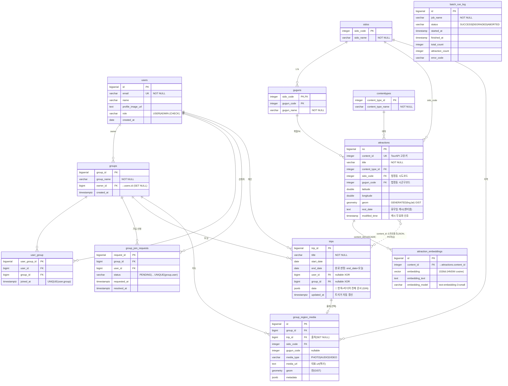

# ER 다이어그램 — 어디갈래?(WSWG)

> **기준 소스**: `backend/src/main/resources/db/postgres/schema.sql` (PostgreSQL 16 + PostGIS + pgvector)
> **테이블 12개**: 회원 1 · 관광 마스터 5 · 모임 3 · 여행/지도 2 · 운영 로그 1
> 설계 철학: **자기 여행 안에서 끝나는 데이터(항목·미디어)는 `trips.data` JSONB 문서**,
> **다른 엔티티와 관계·제약이 있는 것(그룹 지도 대표 미디어)은 관계형 테이블**.

---

## 1. 통합 ERD



---

## 2. 테이블 역할 (12개)

### 🌐 관광 마스터 (TourAPI 배치 적재)
| 테이블 | 역할 |
|--------|------|
| `sidos` / `guguns` | 지역 코드표 (guguns = 복합 PK) |
| `contenttypes` | 테마 = 콘텐츠 타입 8종 (정적 시드) |
| `attractions` | **명소·카페·식당 위치 정보**. content_id NOT NULL UNIQUE, geom GENERATED, rest_date/modified_time = A-6 write-through 캐시 |
| `attraction_embeddings` | **AI 의미 검색용 벡터(pgvector 1536차원)**. OpenAI 임베딩, HNSW 코사인 인덱스 |

### 👤 회원·모임
| 테이블 | 역할 |
|--------|------|
| `users` | 회원 (role CHECK, OAuth2 가입) |
| `groups` | 모임 = 지도 1개의 주인. owner_id |
| `user_group` | 멤버 매핑 (UNIQUE) |
| `group_join_requests` | **초대 링크 가입 신청·승인 큐** (status, UNIQUE(group,user)) |

### 🧳 여행 & 지도
| 테이블 | 역할 |
|--------|------|
| `trips` | **여행(계획↔기록)**. 날짜·소유자는 컬럼, **항목·미디어 전체는 `data` JSONB 문서**. user/group XOR, end_date로 계획→기록 전환 |
| `group_region_media` | **그룹 지도: 지역당 대표 추억 1개**. trips.data 미디어 중 골라 복사. UNIQUE(group, 지역) |

### 🛠 운영
| 테이블 | 역할 |
|--------|------|
| `batch_run_log` | **TourAPI 적재 감사 로그**. 매 실행 1행 (SUCCESS/DEGRADED/ABORTED) |

---

## 3. `trips.data` JSONB 구조 (문서, 강제 아님)

```jsonc
{
  "items": [
    {
      "content_id": 126508,        // TourAPI 관광지면 소프트 참조, 자유항목이면 null
      "title": "경복궁",
      "type": "관광",              // 관광/식당/숙박/이동/메모…
      "lat": 37.5796, "lng": 126.9770,
      "visitDate": "2026-07-01", "order": 1, "time": "10:00",
      "media": [
        { "type": "PHOTO", "url": "...", "metadata": { "w":4032, "h":3024 } }
      ],
      "properties": { "budget": 0, "rating": 5, "memo": "일출" }
    }
  ]
}
```
- **핵심값(날짜·소유자)은 trips 컬럼**, **항목들은 data** = 하이브리드
- 동시 편집 대상 = `data` (Redis live 문서 ↔ Batch Worker가 통째 flush)
- `idx_trips_data_gin`(GIN)으로 "content_id X 포함 여행" 검색 가능

---

## 4. 확정 규칙

1. **항목/미디어 = `trips.data` JSONB** (자기 여행 안에서만 쓰임 → 문서가 적합)
2. **그룹 지도 대표 미디어 = `group_region_media` 관계형** (group·trip FK + 지역당 1개 UNIQUE)
3. **attractions는 정규화 유지** (마스터, 검색·자동생성에 필요). trips.data는 content_id만 소프트 참조(FK 아님)
4. **좌표 3NF**: lat/lng 입력원, attractions.geom은 GENERATED 파생
5. **AI 검색**: `attraction_embeddings`에 OpenAI 임베딩 저장, HNSW 인덱스로 의미 유사도 검색(pgvector)
6. **삭제 정책**: 개인여행 user CASCADE / group_region_media는 trip SET NULL(보존) / groups.owner SET NULL

---

## 5. schema.sql ↔ ERD 동기화 (2026-06-25 최신화)
- 기존 ERD(9테이블) 대비 **+3 테이블 반영**: `attraction_embeddings`(AI 의미검색), `group_join_requests`(가입 승인), `batch_run_log`(적재 로그)
- `groups.owner_id`, `attractions.rest_date`·`modified_time` 컬럼 추가 반영
- ⚠️ `CREATE TABLE IF NOT EXISTS` 기반이라 신규 컬럼은 `ALTER ... ADD COLUMN IF NOT EXISTS`로 보강 (idempotent)

> 작성 메모: GitLab/GitHub에서 Mermaid `erDiagram`으로 자동 렌더링. PDF·Word 제출 시 [mermaid.live](https://mermaid.live)에서 PNG/SVG 내보내기.
