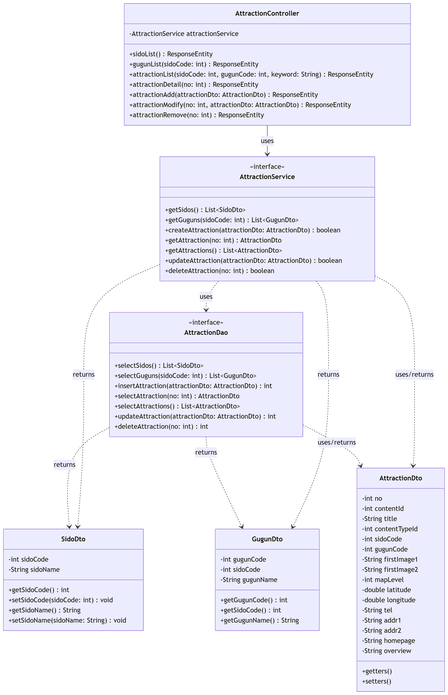

# 어디갈래? (Where Should We Go, WSWG)

> **여행 계획을 자동으로 생성하고, 함께 수정할 수 있는 협업형 여행 플래너 서비스**

---

## 1. 프로젝트 소개
**어디갈래?(WSWG)**는 여행 준비 과정의 번거로움을 해결하기 위한 서비스입니다. 사용자가 지역과 스타일을 선택하면 최적의 관광 데이터를 기반으로 일정을 자동 생성하며, 초대된 동행인과 함께 실시간으로 계획을 수정할 수 있는 협업 환경을 제공합니다.

### 🌟 핵심 가치
- **시간 단축**: 데이터 기반 자동 일정 생성으로 계획 수립 시간 최소화
- **협업 경험**: Google Docs 스타일의 공동 편집 기능을 통한 의사결정 단순화
- **사용자 맞춤**: 개인의 여행 스타일과 선호도를 반영한 장소 추천

---

## 2. 핵심 기능 (MVP)
- **여행 계획 자동 생성**: 지역, 기간, 인원, 스타일 정보를 기반으로 날짜/시간별 일정 추천
- **공동 편집 기능**: 공유 링크를 통해 초대된 사용자와 일정 항목 추가/수정/삭제 동기화
- **관광지 정보 제공**: 전국 시/도, 구/군별 상세 관광지 데이터 및 키워드 검색
- **마이페이지**: 내가 생성하거나 참여 중인 여행 계획 목록 관리

---

## 3. 기술 스택
- **Backend**: Java, Spring Boot, Spring Data JPA
- **Database**: MySQL (Sido, Gugun, Attraction 데이터 관리)
- **Cache/Real-time**: Redis, Socket.io (준실시간 일정 동기화)
- **Frontend**: Vue.js / React (선택 사항)

---

## 4. 개발 로드맵 (Gantt Chart)

개발 일정은 **2026년 5월 18일**부터 **6월 12일**까지 총 4주간 진행됩니다.

### 📅 월별 일정 요약
| Phase | Task | May W3 | May W4 | Jun W1 | Jun W2 |
| :--- | :--- | :---: | :---: | :---: | :---: |
| **1. 설계** | 요구사항 확정 및 DB/API 설계 | █ | | | |
| **2. 인프라** | 개발 환경 구축 및 인증 시스템 | | █ | | |
| **3. 데이터** | 관광지 조회 및 검색 모듈 완성 | | █ | | |
| **4. 핵심** | 일정 자동 생성 알고리즘 구현 | | | █ | |
| **5. 협업** | 공동 편집 및 동기화 처리 | | | | █ |
| **6. 안정화** | 테스트 및 서비스 배포 | | | | █ |

---

## 5. 상세 WBS (Work Breakdown Structure)

| ID | 구분 | 작업 내용 | 시작일 | 종료일 | 상태 |
| :--- | :--- | :--- | :---: | :---: | :---: |
| **P1** | **기획/설계** | 요구사항 정의 및 ERD/API 설계 | 05/18 | 05/22 | 완료 |
| **P2** | **기초 개발** | 개발 환경 세팅 및 회원 인증 API | 05/25 | 05/27 | 대기 |
| **P3** | **관광 데이터** | 시도/구군/관광지 CRUD 및 검색 API | 05/27 | 06/02 | 대기 |
| **P4** | **자동 생성** | 여행 일정 자동 생성 로직 (Algorithm) | 06/02 | 06/05 | 대기 |
| **P5** | **협업 기능** | Socket.io 기반 일정 공동 편집 구현 | 06/08 | 06/11 | 대기 |
| **P6** | **완성** | 통합 테스트 및 클라우드 배포 | 06/11 | 06/12 | 대기 |

---

## 6. 데이터 구조 (Attraction ERD)
- **Sido (1) : (N) Gugun**

classDiagram
    %% DTO Classes
    class SidoDto {
        -int sidoCode
        -String sidoName
        +getSidoCode() int
        +setSidoCode(sidoCode: int) void
        +getSidoName() String
        +setSidoName(sidoName: String) void
    }

    class GugunDto {
        -int gugunCode
        -int sidoCode
        -String gugunName
        +getGugunCode() int
        +getSidoCode() int
        +getGugunName() String
    }

    class AttractionDto {
        -int no
        -int contentId
        -String title
        -int contentTypeId
        -int sidoCode
        -int gugunCode
        -String firstImage1
        -String firstImage2
        -int mapLevel
        -double latitude
        -double longitude
        -String tel
        -String addr1
        -String addr2
        -String homepage
        -String overview
        +getters()
        +setters()
    }

    %% DAO Interface
    class AttractionDao {
        <<interface>>
        +selectSidos() List~SidoDto~
        +selectGuguns(sidoCode: int) List~GugunDto~
        +insertAttraction(attractionDto: AttractionDto) int
        +selectAttraction(no: int) AttractionDto
        +selectAttractions() List~AttractionDto~
        +updateAttraction(attractionDto: AttractionDto) int
        +deleteAttraction(no: int) int
    }

    %% Service Interface
    class AttractionService {
        <<interface>>
        +getSidos() List~SidoDto~
        +getGuguns(sidoCode: int) List~GugunDto~
        +createAttraction(attractionDto: AttractionDto) boolean
        +getAttraction(no: int) AttractionDto
        +getAttractions() List~AttractionDto~
        +updateAttraction(attractionDto: AttractionDto) boolean
        +deleteAttraction(no: int) boolean
    }

    %% Controller (Inferred from API spec)
    class AttractionController {
        -AttractionService attractionService
        +sidoList() ResponseEntity
        +gugunList(sidoCode: int) ResponseEntity
        +attractionList(sidoCode: int, gugunCode: int, keyword: String) ResponseEntity
        +attractionDetail(no: int) ResponseEntity
        +attractionAdd(attractionDto: AttractionDto) ResponseEntity
        +attractionModify(no: int, attractionDto: AttractionDto) ResponseEntity
        +attractionRemove(no: int) ResponseEntity
    }

    %% Relationships
    AttractionController --> AttractionService : uses
    AttractionService ..> AttractionDao : uses
    
    AttractionDao ..> SidoDto : returns
    AttractionDao ..> GugunDto : returns
    AttractionDao ..> AttractionDto : uses/returns
    
    AttractionService ..> SidoDto : returns
    AttractionService ..> GugunDto : returns
    AttractionService ..> AttractionDto : uses/returns
- **Sido (1) : (N) Attraction**
- **Gugun (1) : (N) Attraction**

기본 관광 데이터는 한국관광공사 API 및 공공 데이터를 기반으로 구성됩니다.

erDiagram
    SIDO {
        int sidoCode PK "시/도 코드"
        string sidoName "시/도 이름"
    }

    GUGUN {
        int gugunCode PK "구/군 코드"
        int sidoCode FK "시/도 코드"
        string gugunName "구/군 이름"
    }

    ATTRACTION {
        int no PK "관광지 고유 번호"
        int contentId "관광지 콘텐츠 ID"
        string title "관광지 이름"
        int contentTypeId "관광지 타입 ID"
        int sidoCode FK "시/도 코드"
        int gugunCode FK "구/군 코드"
        string firstImage1 "대표 이미지 URL"
        string firstImage2 "썸네일 이미지 URL"
        int mapLevel "지도 확대 레벨"
        double latitude "위도"
        double longitude "경도"
        string tel "전화번호"
        string addr1 "기본 주소"
        string addr2 "상세 주소"
        string homepage "홈페이지"
        string overview "관광지 설명"
    }

    SIDO ||--o{ GUGUN : "1:N 포함"
    SIDO ||--o{ ATTRACTION : "1:N 포함"
    GUGUN ||--o{ ATTRACTION : "1:N 포함"

[어디갈래? ERD 다이어그램 확인 및 편집하기](https://mermaid.live/edit#pako:eNqtVl1v2jAU_SuWpUmgUQYUaBNVSAimCqlbp9KniRc3vgSriR05TjtW0d8-JyRgJ-Gj23iCe8-5X8e--A17ggJ2sReQOJ4y4ksSLjjSn0-f0PTxHk1SB8RbW4ZCc0bFVAn0tjWmnwvGFYq1faLDGea5koz7mec7CQ3PZx_UPMc3mkjTDV9s-IqgboppohfBaDVKGltH2WarBsrcRQ1uDjNjbRbcbPA28RNe16GfOkotHu88Y1Rbvy0CVXo_NpeCWNNuqYOxUpJ4ionaNrgoGTzBFXA1o9UGFFMB1MMf1xFYlAOjODS5PMOSyVjNQuJD95izV4oYkugOXiAwzFQkTwGggOiiEytV4RHcL7uKPq1IuZFQKrv15l7VvBIhRLrSqke8gHxh8GprqUDGjaZ9XE3bTtP0Ko7v0UxPXS6JBweUJpbSNzeswI9GVpIAvOyM6UTojsXqPb_Q7xVUdtri8h3MOMUdMUmMxyDVvqIGMY-ha5_K6qVPMxpkLvJ8Fu0IY9ePRTALTCJKFPxlgVSns8i7Anc4U7F5KrkHp1QrYGcol6-GY7IVG-J8zTwJHxnJkxABEG6n_IhoFvy_K1Yt77BqFtZUbqLXmxRBABI1ZnwJUgJFSylCNP4xQ3EEXrNeS4Nortyq2KRsMU-1Fi6diR7NA8SRHhJ85Xqhrc0hpkJmoJLMBxn7jFVaa7-d89_PsH4Vku7_Ks-IOwVFWLAf7xmUMaUn9DwjyDdB2XJd5G2hfw74AKHe18cbMY_LA6R_OBqxYlH-Tqo9EhcXo5p776Jk97yqetvtUWnDm_gyK_WnjOKB5iIJKpE8PgTcPXROIu0HxbaILxbnWAsnCzLBp4s6MJ1KYbiFfckodpVMoIVDkCFJf-Lsdi6wWoF-mGFXf6VEPi_wgm80JyL8pxBhQZMi8VfYXZIg1r-2Cyl_Ke-sEjgFOREJV9jtdntZEOy-4V_Y7Tmddr83GA6Hg6v-4MrpXrXwOjW3O4NrZ9BxBt2e4_R7l5sW_p3l7bSdTr9_7fQ16fqyPxw6mz8LuMHQ)

## usecase
유스케이스 다이어그램(mermaid, GitHub 자동 렌더) + 22 UC 상세 명세는 **[usecase.md](./usecase.md)** 참고.
> 정적 이미지 `usecase.png`는 피벗 이전(18 UC) 버전이라 폐기 — 정본은 usecase.md.

## 화면 정의
화면 목록·흐름(S1~S9 + 관리자)은 **[usecase.md](./usecase.md) §6 화면 도출**이 정본.
> `wireframe.html`(7화면)은 피벗 이전·이메일 로그인 폼 포함이라 폐기.
