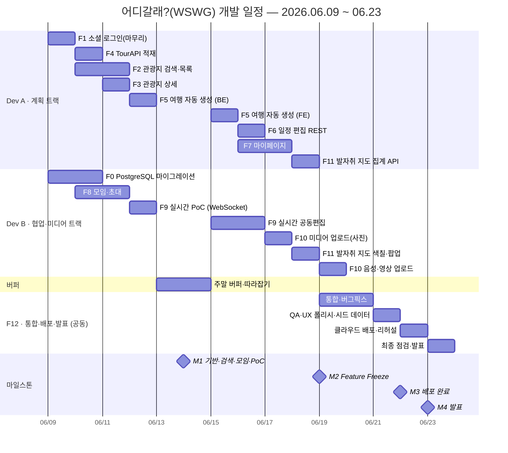

# WBS & 간트 차트 — 어디갈래?(WSWG)

> **기간**: 2026-06-09(화) ~ 06-23(화) · 15일 · **풀스택 2명** (Dev A=계획 트랙 / Dev B=협업·미디어 트랙)
> **출처**: [기능별작업분해](../docs/기능별작업분해.md) · [프로젝트계획](../docs/프로젝트계획.md)
> 일정 표기: `D1`=6/9 … `D15`=6/23

---

## 1. WBS (Work Breakdown Structure)

| ID | 기능 (Work Package) | FR | 트랙 | 일정 | 마일 | 선행 |
|----|------|----|------|------|------|------|
| **F0** | PostgreSQL 마이그레이션·인프라 | CON-01 | B | D1–D2 | M1 | — |
| **F1** | 소셜 로그인(마무리) | FR-AUTH | A | D1 | M1 | — |
| **F2** | 관광지 검색·목록 | FR-TOUR-01,02,04 | A | D2–D3 | M1 | F4 |
| **F3** | 관광지 상세 | FR-TOUR-03 | A | D3 | M1 | F4 |
| **F4** | TourAPI 적재 | FR-TOUR-05 | A | D2 | M1 | F0 |
| **F5** | 여행 자동 생성 (AI) | FR-PLAN-01,02 | A | D4(BE)+D7(FE) | M2 | F2,F4 |
| **F6** | 일정 편집 REST | FR-PLAN-03~07 | A | D8 | M2 | F5 |
| **F7** | 마이페이지 | FR-MY | A | D8–D9 | M2 | F6,F8 |
| **F8** | 모임·초대 | FR-GRP | B | D2–D3 | M1 | F0,F1 |
| **F9** | 실시간 공동편집 | FR-COL | B | D4(PoC)+D7–D8 | M2 | F6,F8 |
| **F10** | 멀티미디어 업로드 | FR-MAP-01~03,07 | B | D9(사진)+D11(음성/영상) | M2 | F0,F8 |
| **F11** | 발자취 지도(집계·색칠·팝업) | FR-MAP-04~07 | B/A | D10 | M2 | F10 |
| **F12** | 통합·QA·배포·발표 | NFR-* | A+B | D11–D15 | M3,M4 | 전체 |

> 마일스톤: **M1**(6/14) 기반·검색·모임·인프라 PoC / **M2 Freeze**(6/19) 전 기능 1차 동작 / **M3**(6/22) 배포 / **M4**(6/23) 발표

---

## 2. 간트 차트

---

## 3. 일자별 ↔ 기능 매핑

| 일자 | Dev A (계획) | Dev B (협업·미디어) | 마일 |
|------|-------|-------|------|
| D1 6/9 | DDL/컨트랙트, **F1** | DDL/컨트랙트, **F0** 시작 | M0 |
| D2 6/10 | **F4**, F2 시작 | **F0** 완료, **F8** 시작 | |
| D3 6/11 | **F2**, **F3** | **F8**, 스토리지 셋업 | |
| D4 6/12 | **F5**(BE) | **F9 PoC** 게이트 | |
| D5–6 6/13–14 | 버퍼 | 버퍼 | 🏁 **M1** |
| D7 6/15 | **F5**(FE) | **F9** 이벤트/fan-out | |
| D8 6/16 | **F6**, F7 시작 | **F9** 동기화/프레즌스 | |
| D9 6/17 | **F7** | **F10**(사진) | |
| D10 6/18 | **F11** 집계 API+지도 | **F11** 색칠/팝업 | |
| D11 6/19 | F10 음성/영상, 통합 | 통합 | 🏁 **M2 Freeze** |
| D12 6/20 | 통합·버그픽스 | 통합·버그픽스 | |
| D13 6/21 | QA·폴리시·시드 | QA·폴리시 | |
| D14 6/22 | 배포·리허설 | 배포·리허설 | 🏁 **M3** |
| D15 6/23 | 발표 | 발표 | 🏁 **M4** |

> 작성 메모: Mermaid `gantt`로 GitHub/GitLab에서 자동 렌더링. PDF·Word 제출 시 [mermaid.live](https://mermaid.live)에서 PNG/SVG 내보내기.
