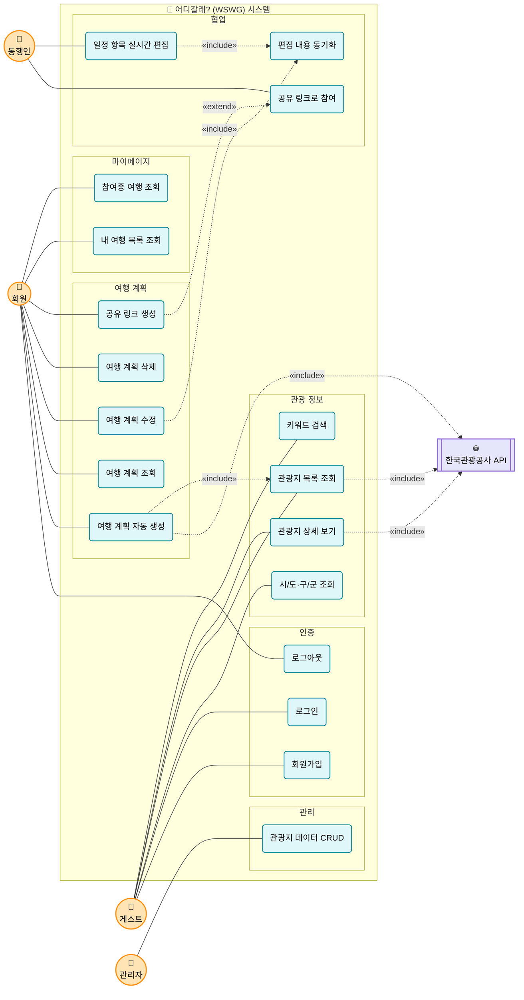

# 유스케이스 다이어그램 — 어디갈래? (WSWG)

> 협업형 여행 플래너 서비스 **어디갈래?(WSWG)** 의 유스케이스 다이어그램입니다.
> 시스템 외부 액터(사용자/외부 API)와 시스템이 제공하는 기능(유스케이스) 간 관계를 정리합니다.

---

## 1. 액터 정의

| 액터 | 설명 |
| :--- | :--- |
| **게스트 (Guest)** | 비로그인 상태의 방문자. 관광 정보 열람 및 회원가입 가능 |
| **회원 (User)** | 로그인한 일반 사용자. 여행 계획을 직접 생성/수정/공유 |
| **동행인 (Companion)** | 공유 링크로 초대받아 일정 공동 편집에 참여하는 사용자 |
| **관리자 (Admin)** | 관광지 마스터 데이터를 관리하는 운영 주체 |
| **한국관광공사 API** | 관광지 원천 데이터를 제공하는 외부 시스템 |

---

## 2. 다이어그램

---

## 3. 액터-유스케이스 권한 매트릭스

| 유스케이스 | Guest | 회원 | 동행인 | 관리자 |
| :--- | :---: | :---: | :---: | :---: |
| 회원가입 | ✅ | | | |
| 로그인 | ✅ | | | |
| 로그아웃 | | ✅ | ✅ | ✅ |
| 시/도·구/군 조회 | ✅ | ✅ | ✅ | ✅ |
| 관광지 목록 조회 | ✅ | ✅ | ✅ | ✅ |
| 관광지 상세 보기 | ✅ | ✅ | ✅ | ✅ |
| 키워드 검색 | ✅ | ✅ | ✅ | ✅ |
| 여행 계획 자동 생성 | | ✅ | | |
| 여행 계획 조회 | | ✅ | ✅ | |
| 여행 계획 수정 | | ✅ | | |
| 여행 계획 삭제 | | ✅ | | |
| 공유 링크 생성 | | ✅ | | |
| 공유 링크로 참여 | | | ✅ | |
| 일정 항목 실시간 편집 | | ✅ | ✅ | |
| 편집 내용 동기화 | | ✅ | ✅ | |
| 내 여행 목록 조회 | | ✅ | | |
| 참여중 여행 조회 | | ✅ | | |
| 관광지 데이터 CRUD | | | | ✅ |

---

## 4. 주요 관계 설명

### Include 관계 (`<<include>>`)
유스케이스 실행 시 **반드시 함께 수행**되는 종속 관계.

- **여행 계획 자동 생성** → **관광지 목록 조회**: 일정 추천을 위한 관광지 데이터 조회가 필수
- **여행 계획 수정 / 실시간 편집** → **편집 내용 동기화**: 모든 편집 동작은 Socket.io 기반 동기화를 동반
- **관광지 조회/상세/자동 생성** → **한국관광공사 API**: 원천 데이터 의존

### Extend 관계 (`<<extend>>`)
**선택적으로 확장**되는 관계.

- **공유 링크로 참여** ← **공유 링크 생성**: 회원이 공유 링크를 생성한 경우에만 동행인의 참여 유스케이스가 활성화됨

---

## 5. 시나리오 예시 — 여행 계획 협업 생성

1. **회원**이 로그인 후 `여행 계획 자동 생성` (지역·기간·인원·스타일 입력)
2. 시스템이 내부적으로 `관광지 목록 조회`를 수행 (한국관광공사 API include)
3. 생성된 일정에 대해 `공유 링크 생성`
4. **동행인**이 링크를 통해 `공유 링크로 참여`
5. 회원과 동행인이 동시에 `일정 항목 실시간 편집` 수행
6. 모든 변경은 `편집 내용 동기화`를 통해 Redis/Socket.io로 즉시 전파
