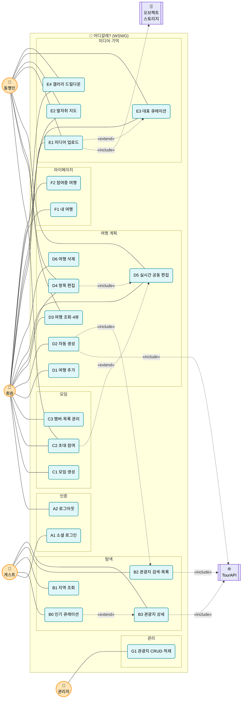

# 유스케이스 명세 — 어디갈래? (WSWG)

> 협업형 여행 플래너 **어디갈래?(WSWG)** 의 유스케이스 명세서.
> **이 문서의 용도**: 화면(UI) 생성의 입력. 각 UC의 *주 흐름 + 입력/출력 데이터*가 곧 화면의 버튼·폼·리스트가 된다.
> **데이터/모델 정본**: `docs/ERD.md`(9테이블) · `artifact/trips-data-schema.md` · `기능명세서 v2.1`
> **문서 버전**: v2.1 (9테이블 문서모델·모임 모델·발자취 지도 격상·인기 큐레이션 반영) / **개정**: 2026-06-23

---

## 1. 액터 정의

| 액터 | 설명 |
| :--- | :--- |
| **게스트 (Guest)** | 비로그인 방문자. 메인 큐레이션·관광 정보 열람, 소셜 로그인 가능 |
| **회원 (User)** | 로그인 사용자. 모임/여행 생성·편집·기록 |
| **동행인 (Companion)** | 모임에 초대받아 공동 편집·미디어에 참여하는 회원 |
| **관리자 (Admin)** | 관광지 마스터 데이터 관리 운영 주체 |
| **TourAPI** | 한국관광공사 — 관광지 원천 데이터 외부 시스템 |
| **오브젝트 스토리지** | 미디어 원본 저장(S3/MinIO) — URL/썸네일 발급 |

> 동행인 = 회원의 한 역할(모임 멤버). 별도 계정 종류가 아니라 "특정 모임에서의 권한 상태".

---

## 2. 여행 라이프사이클 (3단계) — 화면 흐름의 척추

UC는 여행의 **시간 상태**(start/end vs 오늘)를 따라 세 단계로 흐른다. 같은 `trips.data` 문서가 단계를 관통한다.

```
탐색/영감            ① 계획 (오늘<start)        ② 즐기다 (start≤오늘≤end)   ③ 기억 (end<오늘)
─────────────────   ────────────────────────   ──────────────────────────  ────────────────────
B0 인기 큐레이션  →  C1 모임 → D1/D2 여행생성   E1 현장 미디어 업로드        자동 완료 판정
B2/B3 관광지 탐색    C2 초대 → D3/D4 편집        (= D4 편집의 시간적 변주)    E3 대표 큐레이션
                     D5 실시간 공동편집                                      E2 발자취 지도
                                                                            E4 갤러리 회고
        ▲                                                                          │
        └────────────────────  기억이 다음 영감으로 (완료 여행 → 인기 집계)  ◀──────┘
```

---

## 3. 유스케이스 다이어그램 · 인벤토리 (22)



### 인벤토리

| ID | 유스케이스 | 액터 | 단계 | 화면 |
|----|-----------|------|------|------|
| **A1** | 소셜 로그인 | 게스트 | - | S2 |
| **A2** | 로그아웃 | 회원 | - | 전역 |
| **B0** | 메인 인기 큐레이션 조회 | 게스트·회원 | 탐색 | S1 |
| **B1** | 지역(시도·구군) 조회 | 전체 | 탐색 | S3 |
| **B2** | 관광지 검색·목록 | 전체 | 탐색 | S3 |
| **B3** | 관광지 상세 보기 | 전체 | 탐색 | S4 |
| **C1** | 모임 생성 | 회원 | 계획 | S9 |
| **C2** | 모임 초대·참여 | 회원·동행인 | 계획 | S9 |
| **C3** | 모임 멤버·목록 관리 | 회원 | 계획 | S9 |
| **D1** | 여행 추가(수동) | 회원 | 계획 | S6 |
| **D2** | 여행 자동 생성 | 회원 | 계획 | S5→S6 |
| **D3** | 여행 조회(일정·갤러리·지도·보드 뷰) | 회원·동행인 | 전체 | S6 |
| **D4** | 여행 항목 편집 | 회원·동행인 | 계획·즐기다 | S6 |
| **D5** | 실시간 공동 편집 | 회원·동행인 | 계획·즐기다 | S6 |
| **D6** | 여행 삭제 | 회원 | - | S6·S7 |
| **E1** | 항목 미디어 업로드 | 회원·동행인 | 즐기다 | S6 |
| **E2** | 발자취 지도 조회 | 회원·동행인 | 기억 | S8 |
| **E3** | 지도 대표 추억 큐레이션 | 회원·동행인 | 기억 | S8·S6 |
| **E4** | 지역 미디어 갤러리 드릴다운 | 회원·동행인 | 기억 | S8 |
| **F1** | 내 여행 목록 조회 | 회원 | - | S7 |
| **F2** | 참여중 여행 조회 | 회원 | - | S7 |
| **G1** | 관광지 마스터 CRUD·적재 | 관리자 | - | S-ADM |

---

## 4. 권한 매트릭스

| 유스케이스 | 게스트 | 회원 | 동행인 | 관리자 |
| :--- | :---: | :---: | :---: | :---: |
| A1 소셜 로그인 | ✅ | | | |
| A2 로그아웃 | | ✅ | ✅ | ✅ |
| B0 인기 큐레이션 | ✅ | ✅ | ✅ | ✅ |
| B1 지역 조회 | ✅ | ✅ | ✅ | ✅ |
| B2 관광지 검색 | ✅ | ✅ | ✅ | ✅ |
| B3 관광지 상세 | ✅ | ✅ | ✅ | ✅ |
| C1 모임 생성 | | ✅ | | |
| C2 모임 초대·참여 | | ✅(초대) | ✅(참여) | |
| C3 멤버·목록 관리 | | ✅ | | |
| D1 여행 추가 | | ✅ | ✅ | |
| D2 여행 자동 생성 | | ✅ | | |
| D3 여행 조회 | | ✅ | ✅ | |
| D4 항목 편집 | | ✅ | ✅ | |
| D5 실시간 공동 편집 | | ✅ | ✅ | |
| D6 여행 삭제 | | ✅(소유) | | |
| E1 미디어 업로드 | | ✅ | ✅ | |
| E2 발자취 지도 | | ✅ | ✅ | |
| E3 대표 큐레이션 | | ✅ | ✅ | |
| E4 갤러리 드릴다운 | | ✅ | ✅ | |
| F1 내 여행 | | ✅ | | |
| F2 참여중 여행 | | ✅ | | |
| G1 관광지 CRUD | | | | ✅ |

> 모임 권한은 **평면**(멤버/비멤버). 모임 비소속 접근은 403.

---

## 5. 유스케이스 상세 명세 (화면 생성용)

> 양식: **액터·권한 / 화면 / 트리거·사전조건 / 주 흐름 / 입력·출력 데이터 / API / 대안·예외**.
> "주 흐름"과 "입력·출력 데이터"가 화면 컴포넌트의 직접 근거.

---

### A1. 소셜 로그인
- **액터·권한**: 게스트
- **화면**: S2 로그인
- **트리거**: 랜딩 "시작하기" / 보호 기능 접근 시
- **주 흐름**:
  1. "구글로 시작하기" 또는 "카카오로 시작하기" 클릭
  2. OAuth2 동의 → 콜백 → (최초면 회원 자동 생성) → JWT 발급
  3. 토큰 저장 → S3 또는 직전 의도 화면으로 이동
- **입력·출력**: (입력) 소셜 동의 / (출력) 로그인 상태·프로필(name, profileImageUrl)
- **API**: `GET /oauth2/authorization/{google|kakao}` · `GET /api/auth/me`
- **예외**: 이메일 미동의 400 · 토큰 만료 401→refresh
- **화면 단서**: 소셜 버튼 2개 (⚠️ 이메일/비번 폼 없음)

### A2. 로그아웃
- **액터·권한**: 회원 / 동행인 / 관리자
- **화면**: 전역 헤더·프로필 메뉴
- **주 흐름**: 프로필 메뉴 → 로그아웃 → refresh 무효화 → 랜딩 복귀
- **API**: `POST /api/auth/logout`

---

### B0. 메인 인기 큐레이션 조회 ⭐신규
- **액터·권한**: 게스트·회원 (공개)
- **화면**: S1 랜딩
- **트리거**: 메인 진입
- **주 흐름**:
  1. 랜딩 진입 → 시스템이 **인기 여행지 TOP N** 표시(집계)
  2. 카드 클릭 → B3 관광지 상세(S4)
  3. (회원) 상세에서 "내 여행에 추가"로 계획 진입 / (게스트) 로그인 유도
- **입력·출력**: (입력) period(week|all)·limit / (출력) 여행지 카드 = 썸네일·이름·지역·**"N개 여행에 담김"**
- **데이터 소스**: `trips.data` content_id **집계**(GIN). 익명 카운트만 노출 — 개별 여행 비공개 유지.
- **API**: `GET /api/curation/popular?period=week&limit=8` *(신규)*
- **대안·예외**: 집계 부족 → 이미지 보유 관광지/관리자 추천으로 폴백
- **화면 단서**: Hero + **인기 여행지 캐러셀/그리드** + "시작하기"

### B1. 지역(시도·구군) 조회
- **액터·권한**: 전체
- **화면**: S3 검색바
- **주 흐름**: 시/도 선택 → 구/군 옵션 로드
- **출력**: 시도 목록 · (선택 시) 구군 목록
- **API**: `GET /api/sidos` · `GET /api/guguns?sidoCode=`

### B2. 관광지 검색·목록
- **액터·권한**: 전체
- **화면**: S3 관광지 검색·목록
- **트리거**: 검색바 입력/필터 변경
- **주 흐름**:
  1. 키워드 입력 + 시/도·구/군 + 콘텐츠타입(테마 칩) 선택
  2. 검색 → 카드 그리드 + 페이징
  3. 카드 클릭 → B3 상세
- **입력·출력**: (입력) keyword·sidoCode·gugunCode·contentTypeId·page·size / (출력) 관광지 카드(썸네일·제목·지역·타입)
- **API**: `GET /api/content-types` · `GET /api/attractions?sidoCode=&gugunCode=&contentTypeId=&keyword=&page=&size=`
- **예외**: 결과 없음 → 빈 목록(200) · page/size 음수 400

### B3. 관광지 상세 보기
- **액터·권한**: 전체 ("내 여행에 추가"는 회원)
- **화면**: S4 관광지 상세
- **주 흐름**:
  1. 대표 이미지·제목·주소·카테고리·전화/홈페이지·지도(lat/lng)·overview 표시
  2. (회원) "내 여행에 추가" → 대상 여행 선택 → D4로 블록 추가
- **출력**: 상세 필드 / 지도 핀
- **API**: `GET /api/attractions/{contentId}`
- **예외**: 없는 contentId 404 · 비로그인 "추가" → 로그인 유도

---

### C1. 모임 생성 ⭐신규
- **액터·권한**: 회원
- **화면**: S9 모임 관리
- **트리거**: "모임 만들기"
- **주 흐름**: 모임 이름 입력 → 생성 → 생성자 자동 멤버 → 모임 화면 진입
- **입력·출력**: (입력) group_name / (출력) 모임 카드
- **API**: `POST /api/groups`

### C2. 모임 초대·참여 ⭐신규
- **액터·권한**: 회원(초대) · 동행인(참여)
- **화면**: S9
- **주 흐름**:
  1. (회원) 초대 링크 발급(토큰·만료) 또는 멤버 직접 추가
  2. (동행인) 링크 접속 → 로그인 → "모임 참여" → user_group 매핑
- **입력·출력**: (입력) invite token / (출력) 멤버 목록 갱신
- **API**: `POST /api/groups/{id}/invite-link` · `POST /api/groups/join?token=` · `POST /api/groups/{id}/members`
- **예외**: 만료 토큰 400 · 중복 가입 409
- **관계**: 공유 링크(extend) → 동행인 참여 활성화

### C3. 모임 멤버·목록 관리
- **액터·권한**: 회원(멤버)
- **화면**: S9
- **주 흐름**: 내 모임 목록 조회 / 멤버 목록 보기 / 멤버 제거
- **API**: `GET /api/groups` · `DELETE /api/groups/{id}/members/{userId}`
- **예외**: 비멤버 관리 403

---

### D1. 여행 추가(수동)
- **액터·권한**: 회원·동행인(멤버)
- **화면**: S6 여행 편집
- **트리거**: 모임/마이페이지에서 "새 여행"
- **주 흐름**: 제목·기간(start/end)·소유(개인 or 모임) 입력 → 빈 `trips.data` 생성 → S6 진입
- **입력·출력**: (입력) title·start_date·end_date·(group_id|user_id XOR) / (출력) 빈 여행 문서
- **API**: `POST /api/trips`
- **예외**: end<start 400 · XOR 위반 409 · 비소속 groupId 403

### D2. 여행 자동 생성 ⭐
- **액터·권한**: 회원
- **화면**: S5 자동 생성 입력 → S6 결과
- **트리거**: "자동 생성 ✨"
- **주 흐름**:
  1. 지역(시/도·구/군)·기간·인원·**여행 스타일(다중)** 입력
  2. 시스템: 지역×스타일(→contentType) 후보 → 일자/시간 슬롯 배치 → `trips.data.items[]` 채움
  3. S6 편집 화면으로 이동(편집 가능)
- **입력·출력**: (입력) sidoCode·gugunCode·startDate·endDate·headcount·styles[]·groupId? / (출력) 날짜·시간별 일정 초안
- **API**: `POST /api/plans/auto`
- **대안·예외**: 후보 부족 → `partial:true` 안내 · endDate<startDate 400
- **화면 단서**: 스타일 다중 선택 칩 · 생성 로딩 · 결과 미리보기

### D3. 여행 조회 (일정·갤러리·지도·보드 뷰)
- **액터·권한**: 회원·동행인(멤버)
- **화면**: S6 (뷰 탭)
- **주 흐름**: `trips.data` 1개 원본을 4개 뷰로 — 📅 일정(레일·노드) / 🖼️ 갤러리(media) / 🗺️ 지도(lat/lng) / 📋 보드
- **출력**: visitDate별 타임라인 · 미디어 그리드 · 지도 핀 · 칸반
- **API**: `GET /api/trips/{tripId}` (data 포함)
- **예외**: 비멤버 403
- **화면 단서**: 뷰 전환 탭 · 헤더(제목·기간·참가자 아바타·🔗공유)

### D4. 여행 항목 편집
- **액터·권한**: 회원·동행인(멤버)
- **화면**: S6
- **주 흐름**:
  1. "+추가" → 블록 타입(관광/식당/이동/숙소/메모) 선택
  2. 제목·visitDate·time·durationMin·properties(메모·예산·평점 등) 입력
  3. 저장 → 타임라인/캘린더 반영 · 드래그로 순서·시간 변경
- **입력·출력**: (입력) item 필드(§trips-data-schema) / (출력) 블록 카드
- **API**: 실시간=WS `EDIT_ADD/UPDATE/DELETE/REORDER` → `trips.data` flush · 비실시간=`PATCH /api/trips/{tripId}`
- **예외**: 비멤버 403 · 삭제된 블록 편집 409
- **화면 단서**: 블록 타입별 색/이모지 · 시간 미정 트레이 · 소요시간 라벨

### D5. 실시간 공동 편집 ⭐
- **액터·권한**: 회원·동행인(멤버)
- **화면**: S6
- **주 흐름**:
  1. 같은 여행 열기 → WS 세션 입장(멤버 검증)
  2. 한 명의 편집이 1초 내 타 참가자에 전파(Redis Pub/Sub fan-out)
  3. 신규 참가자는 현재 상태(state) 즉시 로드 · "○○ 편집중" 프레즌스
- **출력**: 실시간 반영 · 참가자 아바타 · 🟢 동기화 상태 · carret 표시
- **API**: `WS /ws/plans/{tripId}` · Redis `plan:{id}:edit|state|stream`
- **예외**: 연결 끊김 → 재연결 후 state 재동기화
- **정책**: 항목 단위 last-write-wins(순번=Redis seq/Stream), DB version 불필요

### D6. 여행 삭제
- **액터·권한**: 회원(소유/멤버)
- **화면**: S6 ⋯ / S7 카드
- **주 흐름**: 삭제 확인 → `trips`(data 통째) 삭제 · `group_region_media`는 trip_id SET NULL(대표 보존)
- **API**: `DELETE /api/trips/{tripId}`

---

### E1. 항목 미디어 업로드 ⭐신규 (즐기다)
- **액터·권한**: 회원·동행인(멤버)
- **화면**: S6 (항목 블록)
- **트리거**: 여행 중/후, 블록에 사진 추가
- **주 흐름**:
  1. 항목 블록에서 "사진 추가" → 파일 선택
  2. 스토리지 업로드 → URL/썸네일 → 해당 `item.media[]`에 append
  3. 갤러리 뷰/블록에 즉시 표시
- **입력·출력**: (입력) file·blockId·mediaType(PHOTO|AUDIO|VIDEO)·metadata / (출력) media 항목
- **API**: `POST /api/trips/{tripId}/media` (multipart, blockId)
- **예외**: 허용외 타입 400 · 용량 초과 413 · 비멤버 403
- **단계**: 사진 → 음성 → 영상 순

### E2. 발자취 지도 조회 ⭐신규·핵심 (기억)
- **액터·권한**: 회원·동행인(멤버)
- **화면**: S8 그룹 발자취 지도
- **트리거**: 모임 → 지도 탭
- **주 흐름**:
  1. 그룹이 **다녀온(end_date<오늘)** 여행 기반으로 권역 표시
  2. **프론트가 GeoJSON 권역을 `group_region_media` 보유 여부로 색칠** + 지역당 대표 핀
  3. 핀/권역 클릭 → E4 갤러리 드릴다운
- **입력·출력**: (출력) 지역별 대표 미디어 + geom(핀) + 우측 대표 추억 카드
- **API**: `GET /api/groups/{groupId}/map`
- **비고**: 색칠 강도는 서버 집계 없음(프론트 렌더). 진행 전 여행은 미노출

### E3. 지도 대표 추억 큐레이션 ⭐신규
- **액터·권한**: 회원·동행인(멤버)
- **화면**: S8 / S6 갤러리
- **주 흐름**: 지역 미디어 중 하나를 "그룹 지도 대표"로 지정 → `group_region_media` upsert(지역당 1개, 기존 교체)
- **입력·출력**: (입력) trip_id·sido/gugun·선택 media url / (출력) 지도 대표 갱신
- **API**: `POST /api/groups/{groupId}/map` · 해제 `DELETE /api/groups/{groupId}/map/{id}`
- **제약**: UNIQUE(group, 지역) — 지역당 1개

### E4. 지역 미디어 갤러리 드릴다운
- **액터·권한**: 회원·동행인(멤버)
- **화면**: S8 팝업/패널
- **주 흐름**: 권역 클릭 → 그 지역 여행들의 `data.items[].media` 집계 → 사진 갤러리/음성·영상 플레이어
- **API**: `GET /api/groups/{groupId}/map?sidoCode=&gugunCode=`

---

### F1. 내 여행 목록 조회
- **액터·권한**: 회원
- **화면**: S7 마이페이지 — "내 여행" 탭
- **주 흐름**: 내가 만든 여행 카드 목록 + 상태 태그(예정/진행중/완료)
- **출력**: 카드(제목·기간·인원·상태·썸네일)
- **API**: `GET /api/mypage/trips?scope=mine`
- **상태 산출**: start>오늘=예정 / start≤오늘≤end=진행중 / end<오늘=완료

### F2. 참여중 여행 조회
- **액터·권한**: 회원
- **화면**: S7 — "참여중 여행" 탭
- **주 흐름**: 내가 속한 모임 여행 카드 목록
- **API**: `GET /api/mypage/trips?scope=joined`

---

### G1. 관광지 마스터 CRUD·적재
- **액터·권한**: 관리자(ADMIN)
- **화면**: S-ADM 관광지 관리
- **주 흐름**: TourAPI 동기 적재 트리거 / 관광지 수동 CRUD
- **API**: `POST/PUT/DELETE /api/admin/attractions[/{no}]`
- **외부**: TourAPI(include)

---

## 6. 화면 도출 (UC → 화면)

| 화면 | URL | 담는 UC | 비고 |
|------|-----|---------|------|
| **S1 랜딩** | `/` | **B0** + 서비스 소개 | Hero + 인기 여행지 큐레이션 + 시작하기 |
| **S2 로그인** | `/login` | A1 | 소셜 버튼 2개 |
| **S3 검색·목록** | `/attractions` | B1·B2 | 필터 + 카드 그리드 + 페이징 |
| **S4 관광지 상세** | `/attractions/{id}` | B3 | 상세 + "내 여행에 추가" |
| **S5 자동 생성** | `/plans/new` | D2 | 조건 입력 폼 → S6 |
| **S6 여행 편집(협업)** | `/trips/{id}` | D1·D3·D4·D5·E1·E3 | 4뷰 탭 · 실시간 · 미디어 |
| **S7 마이페이지** | `/mypage` | F1·F2·D6 | 내/참여 탭 · 상태 태그 |
| **S8 발자취 지도** | `/groups/{id}/map` | E2·E3·E4 | 권역 색칠 + 대표 핀 + 갤러리 |
| **S9 모임 관리** ⭐신규 | `/groups` | C1·C2·C3 | 생성·초대·멤버 |
| **S-ADM 관광지 관리** | `/admin/attractions` | G1 | ADMIN 전용 |

> **신규 화면**: S9 모임 관리. **확장 화면**: S1(인기 큐레이션), S6(4뷰·미디어), S8(핵심).
> wireframe.html(7화면, 피벗 이전·이메일로그인 포함)은 폐기 — 본 표가 화면 정본.

---

## 7. 주요 관계

- **include**: D2 자동생성 → B2 관광지 목록 / D4·D5 편집 → 동기화 / B2·B3·D2 → TourAPI
- **extend**: C2 초대 링크 → 동행인 참여 / B0·B3 → (회원) 계획 진입
- **루프**: ③기억(완료 여행) → B0 인기 집계 → 새 유저 영감 → ①계획
