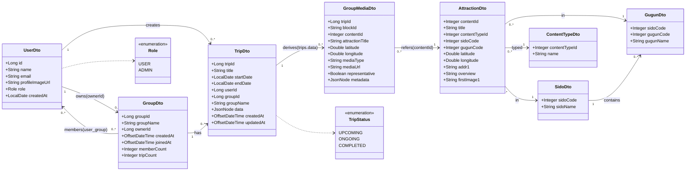
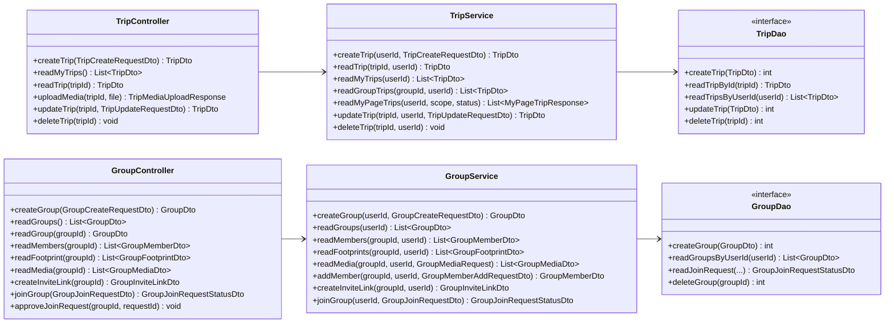
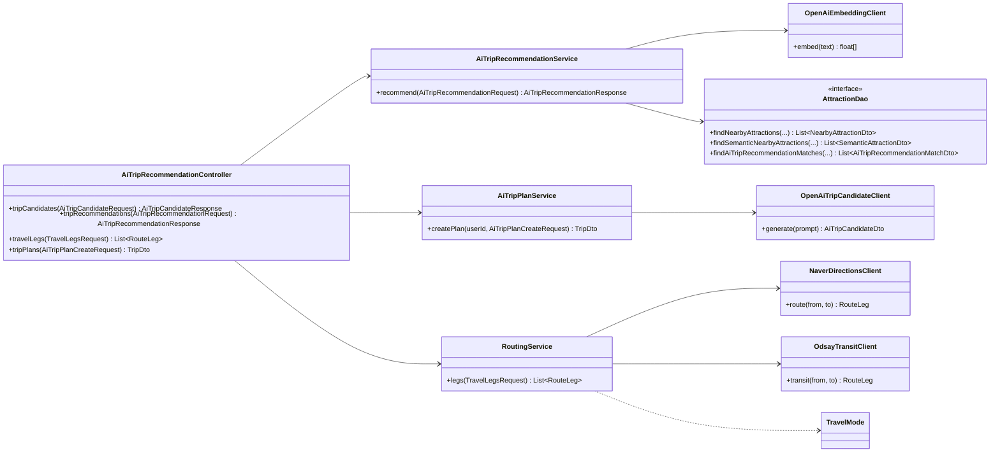
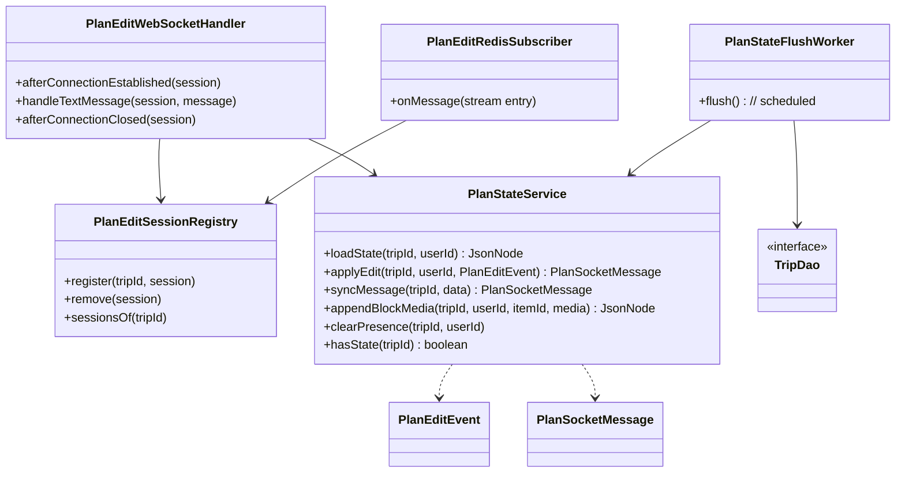

# 클래스 다이어그램 — 어디갈래?(WSWG)

> Spring Boot 백엔드 소스(`com.ssafy.wswg`, 126 클래스) 기반으로 작성.
> 아키텍처: **Controller → Service → DAO(MyBatis) → PostgreSQL**, 외부 연동(TourAPI · OpenAI · Naver · ODsay), 실시간 협업(WebSocket + Redis Stream).

---

## 1. 도메인 모델 (핵심 엔티티 · DTO)

서비스가 다루는 핵심 데이터 구조와 관계. `trips.data`는 블록 에디터 JSON(JSONB)으로 일정·미디어를 담는다.

---

## 2. 계층형 아키텍처 (전체 흐름)

요청이 Controller → Service → DAO로 흐르고, 일부 Service는 외부 클라이언트를 호출한다.

```mermaid
classDiagram
    direction TB

    class AuthController
    class AttractionController
    class RegionController
    class TripController
    class GroupController
    class MyPageController
    class AiTripRecommendationController
    class AdminTourController

    class AttractionService
    class AttractionSearchService
    class AttractionDetailService
    class RegionService
    class TripService
    class GroupService
    class TripMediaService
    class AiTripPlanService
    class AiTripRecommendationService
    class RoutingService
    class TourLoadService
    class RefreshTokenService

    class UserDao
    class AttractionDao
    class RegionDao
    class ContentTypeDao
    class TripDao
    class GroupDao
    class BatchRunLogDao

    class TourApiClient
    class OpenAiEmbeddingClient
    class OpenAiTripCandidateClient
    class NaverDirectionsClient
    class OdsayTransitClient

    AuthController --> RefreshTokenService
    AuthController --> UserDao
    AttractionController --> AttractionSearchService
    AttractionController --> AttractionDetailService
    AttractionController --> AttractionService
    RegionController --> RegionService
    TripController --> TripService
    TripController --> TripMediaService
    GroupController --> GroupService
    MyPageController --> TripService
    MyPageController --> GroupService
    AiTripRecommendationController --> AiTripRecommendationService
    AiTripRecommendationController --> AiTripPlanService
    AiTripRecommendationController --> RoutingService
    AdminTourController --> TourLoadService

    AttractionSearchService --> AttractionDao
    AttractionDetailService --> AttractionDao
    AttractionDetailService --> TourApiClient
    RegionService --> RegionDao
    RegionService --> ContentTypeDao
    TripService --> TripDao
    GroupService --> GroupDao
    AiTripRecommendationService --> AttractionDao
    AiTripRecommendationService --> OpenAiEmbeddingClient
    AiTripPlanService --> OpenAiTripCandidateClient
    AiTripPlanService --> TripDao
    RoutingService --> NaverDirectionsClient
    RoutingService --> OdsayTransitClient
    TourLoadService --> TourApiClient
    TourLoadService --> AttractionDao
    TourLoadService --> BatchRunLogDao
```

---

## 3. 여행·모임 도메인 상세 (메서드 시그니처)

---

## 4. AI 여행 자동 생성 · 추천 (외부 연동)

3단계 흐름: ① 후보 생성(GPT) → ② 의미 검색 매칭(임베딩 + pgvector) → ③ 이동거리·플랜 확정.

---

## 5. 실시간 공동 편집 (WebSocket + Redis Stream)

여러 사용자가 같은 여행 일정을 동시 편집한다. 편집 이벤트는 Redis Stream으로 브로드캐스트되고, 주기적으로 `trips.data`에 플러시된다.

---

## 6. 횡단 관심사 (보안 · 설정)

| 패키지 | 클래스(예) | 역할 |
|---|---|---|
| `security` | JWT 발급·검증 필터, 인증 토큰 처리 | 소셜 로그인 후 액세스/리프레시 토큰 기반 인증 |
| `interceptor` | 인증 인터셉터 | `@RequestMapping` 진입 시 사용자 식별(userId 주입) |
| `config` | WebSocket·Redis·MyBatis·CORS 설정 | 인프라 빈 구성 |
| `external/tour` | `TourApiClient`, `AttractionItemConverter` | TourAPI 호출·응답 변환 |
| `storage` | 파일 스토리지 | 여행 미디어(사진/음성/영상) 업로드 |
| `exception` | `GlobalExceptionHandler`, `ErrorResponseDto` | 통일된 오류 응답(502 등) |

---

### 작성 메모
- 위 다이어그램은 GitLab/GitHub Markdown에서 Mermaid로 렌더링된다. PDF·Word 제출 시 [mermaid.live](https://mermaid.live)에 붙여넣어 PNG/SVG로 내보낸 뒤 첨부한다.
- 전체 클래스 수가 많아(126) DTO·설정 클래스는 §6 표로 요약하고, **핵심 도메인·계층 흐름·시그니처** 중심으로 다이어그램을 구성했다.
