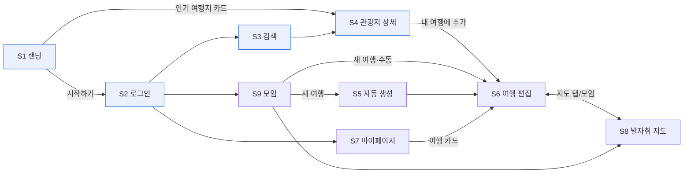

# 화면 정의서 — 어디갈래? (WSWG)

> **용도**: claude design이 화면을 일관되게 생성하기 위한 화면별 명세. *템플릿(§1) → IA(§2) → 공통 셸·컴포넌트(§3) → 상태 분류(§4) → 화면별 정의(§5)*.
> **근거 문서**: [usecase.md](./usecase.md)(UC·주흐름·입출력) · [디자인시스템.md](./디자인시스템.md) v0.3(토큰·컴포넌트·§7 반응형) · [기능명세서.md](./기능명세서.md)(API) · [trips-data-schema.md](./trips-data-schema.md)(블록 데이터)
> **버전**: v0.1 (골격) / **작성일**: 2026-06-23

---

## 1. 화면 정의 템플릿 (작성 규칙)

각 화면(§5)은 아래 9항목을 **이 순서·이 제목**으로 채운다. 빈 항목도 생략하지 말고 "해당 없음"으로 표기.

```
### S{N} 화면명  `/url`
1. 목적        한 줄 — 이 화면이 해결하는 사용자 과업
2. 진입·액터    어디서 옴(이전 화면) / 권한(게스트·회원·동행인·관리자)
3. 담는 UC      usecase.md의 UC ID 나열 (예: D1·D3·D4)
4. 레이아웃
   - 데스크탑   영역 구성(존 단위로). 공통 셸(§3.1) 위에 본문 존 배치
   - 모바일     적응 패턴(디자인시스템 §7.4 기준: drawer·바텀시트·1열·캐러셀 등)
5. 컴포넌트     이 화면이 쓰는 컴포넌트 — **§3.2 공통 목록에서 참조**(새로 만들면 §3.2에 추가 제안 표기)
6. 데이터·API   표시 데이터(필드) / 액션→API(기능명세 신 계약, WS·REST)
7. 상태         §4 분류대로: 기본 / 빈 / 로딩 / 에러 / 권한403 / (해당 시 partial·오프라인)
8. 전환         이 화면에서 갈 수 있는 다음 화면 + 트리거
9. 카피 단서     보이스&톤(해요체) 핵심 문구 1~3개 (헤드라인·빈상태·CTA)
```

**작성 원칙**
- 컴포넌트·색·간격은 **토큰 이름으로** 지칭(예: `--brand`, `--radius`), 하드코딩 금지.
- 데스크탑/모바일 둘 다 명시. "계획(S6)만 데스크탑 우선, 나머지 양쪽 동등"(디자인시스템 §7.1).
- 카피는 **해요체·반말 금지**, anti-trait(허세·사무적·압박) 회피.

---

## 2. IA · 네비게이션 맵

### 2.1 사이트맵 / 라우팅
| 화면 | URL | 공개 | 담는 UC |
|---|---|---|---|
| S1 랜딩 | `/` | 게스트 | B0 |
| S2 로그인 | `/login` | 게스트 | A1 |
| S3 관광지 검색 | `/attractions` | 게스트 | B1·B2 |
| S4 관광지 상세 | `/attractions/{id}` | 게스트 | B3 |
| S5 자동 생성 | `/plans/new` | 회원 | D2 |
| S6 여행 편집 | `/trips/{id}` | 멤버 | D1·D3·D4·D5·E1·E3 |
| S7 마이페이지 | `/mypage` | 회원 | F1·F2·D6 |
| S8 발자취 지도 | `/groups/{id}/map` | 멤버 | E2·E3·E4 |
| S9 모임 관리 | `/groups` | 회원 | C1·C2·C3 |
| S-ADM 관광지 관리 | `/admin/attractions` | 관리자 | G1 |

### 2.2 화면 전환도


> 게스트는 S1~S4까지 열람 가능. 보호 액션(여행 추가·편집·지도)은 로그인 게이트 → S2.

---

## 3. 공통 셸 & 공통 컴포넌트

### 3.1 앱 셸
**데스크탑(≥1024)** — 디자인시스템 §6.1
- 좌측 **워크스페이스 사이드바**(228px): 워크스페이스 스위처 · 홈/검색/지도 · 페이지 트리(모임→여행→일차)
- 상단 **토픽바**: 브레드크럼 · 실시간 동기화 표시 · 동행인 아바타 스택 · 공유
- 본문 **캔버스**

**모바일(<768)** — 디자인시스템 §7.3
- 상단 **앱바**(타이틀·뒤로·⋯) + 햄버거 **off-canvas drawer**(사이드바 내용)
- 패널·필터는 **바텀시트**, 모달은 **풀스크린 시트**

> S1·S2·S3·S4(게스트 탐색)는 셸을 **간소화**(상단 글로벌 헤더 + 로그인 버튼)해도 됨. S5~S9는 앱 셸 위.

### 3.2 공통 컴포넌트 인벤토리
화면들은 아래를 **재사용**한다(화면마다 새로 만들지 않음). shadcn-vue 기준 매핑.

| 컴포넌트 | shadcn-vue | 용도 | 주요 화면 |
|---|---|---|---|
| Button | Button | 액션(Primary=`--brand`) | 전역 |
| Input / Select | Input·Select | 검색·폼 | S3·S5 |
| Tabs | Tabs | 뷰 전환·마이페이지 탭 | S6·S7 |
| Dialog / Sheet | Dialog·Sheet | 모달(데스크탑)·바텀시트(모바일) | 전역 |
| Drawer | Sheet(side) | 모바일 사이드바 | 셸 |
| Avatar / AvatarStack | Avatar | 동행인 프레즌스 | S6·S8·셸 |
| Card | Card | 관광지·여행·추억 카드 | S1·S3·S4·S7·S9 |
| TypeTag(블록타입 칩) | Badge | 관광/식당/이동/숙소/메모(§3.3 색) | S6 |
| PropertyPill | Badge | 💰예산·⭐평점·🎫예약 | S6 |
| Toast | Sonner/Toast | 저장·협업 알림 | 전역 |
| Pagination | Pagination | 목록 페이징 | S3 |
| EmptyState | (공용) | 빈 상태 일러스트+카피 | 전역 |
| Skeleton | Skeleton | 로딩 | 전역 |
| MediaThumbStrip | (공용) | 블록 미디어 썸네일 | S6·S8 |
| BlockCard | (공용) | trips.data item 1개 | S6 |
| TimelineRail | (공용) | Day별 레일+노드 | S6 |
| PresenceCaret | (공용) | 실시간 카렛+이름 | S6 |
| RegionMap | (공용, 지도 SDK) | GeoJSON 권역 색칠+핀 | S8 |
| MemoryPin / MediaPopup | (공용) | 지도 핀·갤러리 팝업 | S8 |

**신규 제안 컴포넌트** (화면 작성 중 도출 — 등록 검토 후 `components/common/`):

| 컴포넌트 | 기반 | 용도 | 화면 |
|---|---|---|---|
| GlobalHeader | (공용) | 게스트 탐색 상단 헤더(로고·로그인) | S1·S3·S4 |
| HeroSection | (공용) | 헤드라인+서브+CTA | S1 |
| PopularCarousel | Carousel | 인기 여행지 가로 캐러셀/스와이프 | S1 |
| SocialAuthButton | Button | 브랜드 아이콘+라벨 소셜 버튼 | S2 |
| FilterChips | Badge | 테마 칩 토글 묶음 | S3·S-ADM |
| StyleChipGroup | Badge | 여행 스타일 다중 선택 칩 | S5 |
| FormSummaryBar | (공용) | 폼 요약 한 줄 | S5 |
| SlashMenu | (공용) | `/` 블록 타입 팝오버(데스크탑) | S6 |
| SyncBadge | Badge | 실시간 동기화 상태 칩 | S6 |
| DragHandle | (공용) | `⋮⋮`(데스크탑)·`⋮`(모바일) 핸들 | S6 |
| RowMenu | DropdownMenu | 카드/행 ⋮ 더보기 | S7 |
| InviteLinkField | Input+Button | 초대 링크 URL+복사+만료 | S9 |
| MemberRow | (공용) | 아바타·이름·역할·제거 | S9 |
| DataTable | Table | 정렬·페이징 데이터 테이블 | S-ADM |
| SyncProgress | Progress | 적재 진행 배너 | S-ADM |

---

## 4. 상태 분류 (공통 규칙)

모든 화면은 아래 상태를 고려한다. 카피는 디자인시스템 §2 보이스&톤(해요체).

| 상태 | 처리 | 카피 예 |
|---|---|---|
| **기본** | 정상 데이터 표시 | — |
| **빈(empty)** | EmptyState(일러스트+CTA) | "아직 계획이 없어요! 첫 여행을 만들어볼까요?" |
| **로딩** | Skeleton(레이아웃 유지) / 자동생성은 진행 인디케이터 | "일정을 짜고 있어요…" |
| **에러** | 인라인 또는 토스트, 재시도 | "잠깐, 길을 잃었어요. 다시 해볼까요?" |
| **권한 403** | 비멤버 차단 + 안내 | "이 여행은 모임 멤버만 볼 수 있어요" |
| **partial**(자동생성) | 가능분 표시 + 보완 안내 | "후보가 적어 일부만 채웠어요" |
| **오프라인/끊김**(S6) | 동기화 배지 회색 + 재연결 | "연결이 끊겨 다시 잇는 중…" |

---

## 5. 화면별 정의

> 아래 각 화면은 §1 템플릿을 따른다. (서브 에이전트가 화면별로 채움)

### S1 랜딩 `/`

**1. 목적**
처음 온 사람이 "어디갈래?가 뭐 하는 곳인지" 한눈에 알고, 지금 인기 있는 여행지를 둘러보다 자연스럽게 시작하기로 넘어가게 해요. 로그인 전에도 영감을 먼저 주는 화면이에요.

**2. 진입·액터**
- **진입**: 외부 유입(검색·공유 링크·직접 입력)으로 `/`에 도착. 로그아웃 직후에도 이리로 돌아와요(A2).
- **액터**: 게스트(주) · 회원(인기 여행지·소개 동일 열람, 상단 CTA만 "내 여행으로"). 공개 화면이라 권한 게이트 없음.

**3. 담는 UC**
- **B0 인기 여행지 추천**(주) — 집계 TOP N 카드, 카드→S4 상세(B0 extend B3). 서비스 소개 + 시작하기(→ A1).

**4. 레이아웃**
- **데스크탑(≥1024)** — 간소화 셸(§3.1: 상단 글로벌 헤더 + 로그인 버튼). 위→아래 세로 스택:
  1. **글로벌 헤더**: 좌측 로고, 우측 "둘러보기"(→S3)·"시작하기" Button(Primary=`--action-bg`). 하단 `--border` hairline.
  2. **Hero**: 헤드라인 + 서브카피 + "시작하기"(주)/"관광지 둘러보기"(보조 ghost). 색 면적 최소(§3 블루 절제), 섹션 패딩 32.
  3. **인기 여행지**: 섹션 타이틀(H2) + **가로 캐러셀**(§7.4) Card 그리드 — 썸네일·이름·지역·"N개 여행에 담김".
  4. **서비스 소개**: 3가치 카드(자동 일정/실시간 공동 편집/관광지 검색) 3열. 평면(그림자 없음, hairline+hover `--hover`).
  5. **하단 CTA**: "시작하기" 반복 + 푸터.
- **모바일(<768)** — §7.4 "세로 스택, 캐러셀 스와이프": 앱바(로고+"시작하기") + 햄버거 drawer. Hero→인기(스와이프 캐러셀, 카드 1.2장 peek)→소개 1열→CTA. 터치 44×44px, 호버 의존 없음.

**5. 컴포넌트** (§3.2 참조)
- **Button**("시작하기" Primary, "둘러보기" 보조) · **Card**(인기 여행지·소개) · **Skeleton**(인기 로딩) · **EmptyState**(폴백) · **Toast**(추천 실패).
- *(신규 제안 §3.2)* **HeroSection**(헤드라인+서브+CTA) · **PopularCarousel**(가로 캐러셀/스와이프) · **GlobalHeader**(게스트 탐색 S1·S3·S4 공용 상단).

**6. 데이터·API**
- **표시 데이터**: 인기 여행지 카드(B0) `thumbnailUrl`(폴백)·`name`·`regionName`·`tripCount`("N개 여행에 담김", 익명 집계)·`contentId`(라우팅 키). Hero·소개 카피는 정적.
- **액션 → API**
  | 액션 | API |
  |---|---|
  | 인기 여행지 로드 | `GET /api/curation/popular?period=week&limit=8` (공개) |
  | 카드 클릭 | → `/attractions/{contentId}` (S4) |
  | "시작하기" | → `/login` (A1) |
  | "둘러보기" | → `/attractions` (S3) |

**7. 상태** (§4)
- **기본**: TOP N 캐러셀 + 소개 + CTA.
- **빈**: 집계 비면 **폴백**(이미지 보유 관광지/관리자 추천)으로 채워 빈 랜딩 회피. 폴백도 없으면 인기 섹션만 숨김(Hero·소개 유지).
- **로딩**: 인기 자리 Card Skeleton. Hero·소개는 즉시 노출.
- **에러**: 인기 섹션만 인라인 에러 + "다시 불러오기"(전체 차단 안 함).
- **권한 403 / partial / 오프라인**: 해당 없음.

**8. 전환**
| 다음 | 트리거 |
|---|---|
| S4 상세 | 인기 여행지 카드 클릭 |
| S2 로그인 | "시작하기" |
| S3 검색 | "둘러보기"/헤더 검색 |
| (회원) S7 마이페이지 | 상단 "내 여행으로" |

**9. 카피 단서** (해요체)
- 헤드라인 "고르기만 하세요, 일정은 저희가 짜드려요" / 서브 "지역이랑 취향만 정하면, 친구들이랑 같이 일정을 다듬을 수 있어요."
- 인기 타이틀 "요즘 다들 여기로 떠나요" / 카드 "N개 여행에 담겼어요" / CTA "시작하기"·"관광지 둘러보기" / 에러 "잠깐, 길을 잃었어요. 다시 불러올까요?"

### S2 로그인 `/login`

**1. 목적**
구글·카카오 소셜 계정으로 한 번에 로그인(최초면 가입 자동)해서 여행을 만들고 함께 편집할 수 있는 회원 상태로 진입해요. (이메일/비번 폼 없음 — 폐기)

**2. 진입·액터**
- **이전 화면**: S1 "시작하기" / 게스트가 보호 액션 시도 시 로그인 게이트.
- **액터**: 게스트. 이미 로그인된 회원 진입 시 직전 의도 화면 또는 S3로 우회.

**3. 담는 UC**
UC-A1(소셜 로그인)

**4. 레이아웃**
간소화 셸(§3.1: 상단 글로벌 헤더 + 로고).
- **데스크탑(≥1024)**: 헤더(로고→S1) + 본문 중앙 **로그인 카드**(`Card`, `--radius-win`): 헤드라인 → "구글로 시작하기" → "카카오로 시작하기" → 약관 마이크로카피. 카드 폭 `md` 단일 컬럼.
- **모바일(<768)**(§7.3·§7.4, S1·S2 양쪽 동등): 앱바(로고·뒤로) + 1열 스택. 두 소셜 버튼 **풀폭 스택**, 터치 44×44px. 라우트 화면이라 일반 1열 페이지.

**5. 컴포넌트** (§3.2)
- `Card`(컨테이너) · `Button`(소셜 2개 — 브랜드 식별색+아이콘+라벨, `--brand` 과용 금지) · `Toast`(실패·취소) · `Skeleton`(콜백 대기).
- *(신규 제안 §3.2)* **SocialAuthButton**(브랜드 아이콘+라벨 표준화, `Button` 기반).

**6. 데이터·API** (기능명세 §1.4)
- 표시 데이터: 정적(헤드라인·버튼 라벨·약관). 입력 필드 없음.
- 액션 → API: "구글/카카오로 시작하기" → `GET /oauth2/authorization/{google|kakao}`(리다이렉트) → 콜백 `GET /login/oauth2/code/{provider}` → JWT 발급 → `GET /api/auth/me`(name·profileImageUrl·email·role). 만료 시 `POST /api/auth/refresh`.

**7. 상태** (§4)
- **기본**: 헤드라인 + 소셜 버튼 2개 + 약관.
- **로딩**: 클릭 후 리다이렉트/콜백 동안 버튼 비활성 + 스피너. "잠깐만요, 로그인하고 있어요…"
- **에러**: 동의 취소·실패 시 Toast + 재시도. 이메일 미동의(400) "이메일 제공에 동의해야 로그인할 수 있어요". 토큰 만료(401) refresh 자동→실패 시 재로그인.
- **빈/권한403/partial/오프라인**: 해당 없음.

**8. 전환**
- 성공 → S3(또는 직전 의도 화면 S6/S9 등) · 진입 경로 따라 S7/S9 분기 · 로고 → S1.

**9. 카피 단서** (해요체)
- 헤드라인 "어디갈래에 오신 걸 환영해요! 소셜 계정으로 바로 시작해요" / CTA "구글로 시작하기"·"카카오로 시작하기" / 약관 "로그인하면 이용약관과 개인정보 처리방침에 동의하는 것으로 볼게요"

### S3 관광지 검색·목록 `/attractions`

**1. 목적**
게스트가 키워드·지역·테마로 가고 싶은 관광지를 찾아 카드로 훑어보고 상세로 들어가는 화면이에요. 회원가입 없이 바로 탐색할 수 있어요.

**2. 진입·액터**
- **이전 화면**: S1 "둘러보기"·헤더 검색, S2 직후, S4 뒤로가기.
- **권한**: 게스트(전체 공개). 보호 액션 없음(S4 "추가"부터 게이트).

**3. 담는 UC**
UC-B1(지역 조회) · UC-B2(관광지 검색·목록)

**4. 레이아웃**
간소화 셸(§3.1, 좌측 사이드바 미노출).
- **데스크탑(≥1024)** (§7.4 "필터바 + 카드 그리드"):
  - **존1 검색바**: 키워드 `Input` + 시/도 `Select` + 구/군 `Select`(시도 선택 시 활성) + 검색 `Button`(Primary).
  - **존2 필터 칩**: 콘텐츠타입 테마 칩(`Badge` 토글, 다중) + 결과 수·정렬.
  - **존3 카드 그리드**: `Card` 3~4열(`--border-strong` hairline, `--radius`) — 썸네일·제목·지역·타입 `Badge`.
  - **존4 페이징**: `Pagination`.
- **모바일(<768)** (§7.4 "필터→바텀시트, 카드 1열"): 앱바 + 키워드 Input + "필터" → 시/도·구/군·테마칩 **바텀시트**(`Sheet`, 적용/초기화). 카드 1열. 터치 44×44px. 양쪽 동등(§7.1).

**5. 컴포넌트** (§3.2)
`Input`·`Select`(검색바) · `Button`(검색) · `Badge`(테마 칩·타입 태그) · `Card`(관광지) · `Pagination` · `Sheet`(모바일 필터) · `EmptyState` · `Skeleton` · `Toast`.
- *(신규 제안 §3.2)* **FilterChips**(테마 칩 토글 묶음).

**6. 데이터·API**
- 표시 데이터(카드): `contentId`·`title`·`sidoName`·`gugunName`·`contentTypeId`·`firstImage1`(null→플레이스홀더). 메타: `page`·`size`·`totalElements`.
- 액션 → API: `GET /api/sidos` · `GET /api/guguns?sidoCode=` · `GET /api/content-types` · `GET /api/attractions?sidoCode=&gugunCode=&contentTypeId=&keyword=&page=&size=`. 카드 클릭 → S4.

**7. 상태** (§4)
- **기본**: 카드 그리드 + 페이징.
- **빈**: 결과 0(200) → `EmptyState` "찾는 곳이 없네요. 키워드나 지역을 바꿔볼까요?" + "필터 초기화".
- **로딩**: 카드 Skeleton(레이아웃 유지). 옵션 로드 중 Select 비활성+스피너.
- **에러**: 인라인/Toast + 재시도. page/size 음수는 클라이언트에서 막아 400 방지.
- **권한403/partial/오프라인**: 해당 없음.

**8. 전환**
- 카드 → S4 상세 · 헤더 "로그인" → S2.

**9. 카피 단서** (해요체)
- 헤드라인 "어디로 떠나볼까요? 가고 싶은 곳을 찾아보세요" / 빈 상태 "찾는 곳이 없네요. 키워드나 지역을 바꿔볼까요?" / CTA "검색하기"

### S4 관광지 상세 `/attractions/{id}`

**1. 목적**
관광지 한 곳의 대표 이미지·기본 정보·위치·소개를 한눈에 보여주고, 회원이라면 그 자리에서 "내 여행에 추가"로 계획으로 이어가게 한다.

**2. 진입·액터**
- **진입**: S1 인기 여행지 카드 / S3 검색 결과 / 외부 공유 딥링크.
- **액터**: 전체 열람 가능(공개). "내 여행에 추가" 액션만 **회원**(비로그인 시 로그인 유도).

**3. 담는 UC**
- **B3** 관광지 상세(주). 회원의 "추가"는 D4(블록 추가, S6) 진입 트리거.

**4. 레이아웃**
간소화 셸(§3.1). 탐색 단계 = 양쪽 동등(§7.1).
- **데스크탑(≥1024)**:
  - **글로벌 헤더**: 로고(→S1)·브레드크럼(`관광지 > {지역} > {제목}`)·"로그인"(또는 프로필 아바타).
  - **히어로**(풀폭): 대표 이미지(`firstImage1`, 16:9) + 제목(Page Title)·카테고리 TypeTag·주소.
  - **2열**(좌:우 ≈ 2:1): 좌 — overview·연락 정보 / 우(sticky) — **"내 여행에 추가"** Primary → 지도(`lat/lng` 핀) → 주소.
- **모바일(<768)**: 앱바(뒤로·제목·공유) + 1열 스택(이미지→제목·카테고리·주소→연락→overview→지도→주소). **"내 여행에 추가"는 하단 고정 액션바**, 누르면 대상 여행 선택 **바텀시트**(터치 44×44px).

**5. 컴포넌트** (§3.2, 신규 없음)
`Card`(연락·지도 묶음) · `Button`("내 여행에 추가" Primary, "로그인") · `TypeTag(Badge)`(카테고리 — 블록타입 색 아닌 뉴트럴/`--t-blue` 1색 절제) · `Dialog`/`Sheet`(추가 시 대상 여행 선택) · `Avatar` · `Skeleton` · `EmptyState`(404) · `Toast`. 지도는 단일 좌표 핀(§6.4, S8의 `RegionMap` 권역 색칠과 구분).

**6. 데이터·API** (`GET /api/attractions/{contentId}`, 기능명세 §3.2)
| 필드 | UI |
|---|---|
| `firstImage1` | 히어로 이미지 |
| `title` | 제목 |
| `addr1`(+`addr2`) | 주소 |
| `contentTypeId` | TypeTag |
| `tel` | `tel:` 링크 |
| `homepage` | 외부 링크 |
| `mapY`/`mapX`(lat/lng) | 지도 핀 |
| `overview` | 소개 본문 |
- **"내 여행에 추가"**(문서모델, 실제 백엔드 기준): (회원) Dialog/시트에서 대상 여행 선택 → 여행 조회 후 `data.items[]`에 블록 append → **`PUT /api/trips/{tripId}`**(전체 갱신, body: `title`·`startDate`·`endDate`·`data`) → Toast/S6 이동. (백엔드엔 행 엔드포인트·`PATCH`·`POST /trips/{id}/attractions` 없음.) (게스트) API 호출 없이 로그인 유도(→S2).

**7. 상태** (§4)
- **기본**: 전체 필드 표시. 빈 필드(tel·homepage·overview·이미지) 행은 숨김.
- **빈(이미지 없음)**: 뉴트럴 플레이스홀더(`--bg-subtle`+아이콘) "아직 사진이 없어요."
- **로딩**: Skeleton(이미지·제목·본문 자리 유지).
- **에러(404)**: `NOT_FOUND` → EmptyState "찾는 관광지가 없어요. 다른 곳을 둘러볼까요?" + "검색으로 가기"(→S3).
- **권한(추가 게이트)**: 게스트가 "추가" 클릭 → 차단 아닌 **로그인 유도** "내 여행에 담으려면 로그인이 필요해요" + 복귀 의도 보존.
- **partial/오프라인**: 해당 없음.

**8. 전환**
| 다음 | 트리거 |
|---|---|
| S2 로그인 | 헤더 "로그인" / 게스트 "추가" 클릭 |
| S6 여행 편집 | (회원) "추가" → 대상 여행 선택 후 |
| S3 검색 | 404 "검색으로 가기" / 브레드크럼 |
| S1 랜딩 | 로고 |
| 외부 | `homepage` 링크 |

**9. 카피 단서** (해요체)
- CTA "내 여행에 추가" / 완료 "여행에 담았어요! 일정도 같이 다듬어볼까요?" / 로그인 유도 "내 여행에 담으려면 로그인이 필요해요." / 404 "찾는 관광지가 없어요. 다른 곳을 둘러볼까요?"

### S5 여행 자동 생성 `/plans/new`

**1. 목적**
지역·기간·인원·여행 스타일만 고르면 시스템이 날짜·시간별 일정 초안을 자동으로 짜주는 화면. 결과는 곧장 S6 편집으로 넘긴다. (UC-D2)

**2. 진입·액터**
- **진입**: S9 "새 여행 → 자동 생성" / S7 "새 여행" / 사이드바 "+ 새 여행".
- **액터·권한**: **회원**. 게스트 진입 시 로그인 게이트 → S2. `groupId` 동반 진입은 멤버만(비소속 403).

**3. 담는 UC**
- **D2** 여행 자동 생성(주). 결과 편집은 S6(D3·D4)로 위임.

**4. 레이아웃**
앱 셸(§3.1) 위 단일 폼 캔버스(중앙 정렬, `--radius-win`).
- **데스크탑(≥1024)**: 사이드바 유지 + 토픽바 브레드크럼 `모임명 › 새 여행 › 자동 생성`. 본문 Page Title+서브 → **2열 폼 그리드**(§7.4). 1열: 지역(시/도→구/군 Select)·기간(출발·종료 date) / 2열: 인원(stepper)·스타일(다중 칩 그리드). 하단 액션바: "자동 생성 ✨"(Primary)·"취소" + 폼 요약("부산 · 2박3일 · 2명 · 자연·도보").
- **모바일(<768)**: 앱바(자동 생성·뒤로), 사이드바 drawer. **1열 폼**(§7.4). 스타일 칩 2열 wrap. **액션바 하단 고정** "자동 생성 ✨" 풀폭(44×44px).
- **공통**: 생성 트리거 시 폼 위 **진행 인디케이터 오버레이**. 성공 → S6 이동(별도 미리보기 단계 없음).

**5. 컴포넌트** (§3.2)
- `Input`/`Select`(시도·구군·date·인원 stepper) · `Button`("자동 생성 ✨" Primary, "취소") · **스타일 칩**(`Badge` 계열 — 선택 시 `--selected-bg`+`--brand` 보더, `--radius-sm`) · `Skeleton`/진행 인디케이터 · `EmptyState`(partial) · `Toast`.
- *(신규 제안 §3.2)* **StyleChipGroup**(다중 칩 그리드) · **FormSummaryBar**(폼 요약 한 줄).

**6. 데이터·API**
- 입력: `sidoCode`(필수)·`gugunCode?`·`startDate`·`endDate`·`headcount`(기본2)·`styles[]`(최소1)·`groupId?`. 옵션 로드 `GET /api/sidos`·`GET /api/guguns?sidoCode=`.
- 액션 → API: "자동 생성 ✨" → `POST /api/plans/auto` `{sidoCode,gugunCode?,startDate,endDate,headcount,styles[],groupId?}` → `tripId`(+`partial`) → **S6 `/trips/{tripId}` 이동**.
- 검증: `endDate<startDate` 400 · 비소속 groupId 403 · XOR 409.

**7. 상태** (§4)
- **기본**: 지역·기간·스타일1+ 채우면 "자동 생성 ✨" 활성(미충족 시 비활성 `--text-faint`).
- **빈**: 모임 진입인데 선택 가능 모임 없으면 EmptyState "함께 갈 모임부터 만들어볼까요?" + S9.
- **로딩**: 폼 위 **진행 인디케이터 오버레이**(Skeleton 아님) + 버튼 스피너. "일정을 짜고 있어요…"
- **partial**: 응답 `partial:true` → S6 진입 직후 배너/Toast "후보가 적어 일부만 채웠어요". 후보 0이면 이 화면 머물며 EmptyState "이 조건엔 갈 곳이 부족해요. 지역이나 스타일을 바꿔볼까요?".
- **에러**: 인라인/Toast 재시도(입력 보존).
- **검증(endDate<startDate)**: 종료일 보더/도움말 `--danger` + "돌아오는 날이 떠나는 날보다 빨라요. 다시 골라볼까요?" + 버튼 비활성.
- **권한 403**: 비멤버 groupId → "이 여행은 모임 멤버만 만들 수 있어요" + 개인 여행 전환 안내.

**8. 전환**
- "자동 생성 ✨" 성공(partial 포함) → S6 · "취소"/뒤로 → 출처(S9/S7) · 모임 없음 CTA → S9 · 401 → S2 후 복귀.

**9. 카피 단서** (해요체)
- 헤드라인 "어디로, 어떤 여행을 떠나볼까요?" / 서브 "지역과 스타일만 고르면, 일정은 저희가 짜드릴게요." / CTA "자동 생성 ✨"·"취소" / 로딩 "일정을 짜고 있어요…" / partial "후보가 적어 일부만 채웠어요" / 검증 "돌아오는 날이 떠나는 날보다 빨라요. 다시 골라볼까요?"

### S6 여행 편집(협업) `/trips/{id}`

> `trips.data` JSONB 1개 원본을 **노션식 블록 에디터**로 시각화 + 4뷰(📅일정·🖼️갤러리·🗺️지도·📋보드) + 실시간 공동 편집. 디자인시스템 §6.2·§6.3·§7.1·§7.4 준수.

**1. 목적**
한 모임의 여행 문서를 멤버들이 한 화면에서 같이 짜고(계획)·현장에서 사진 붙이고(즐기다)·대표로 골라(기억), 카톡으로 흩어지던 조율을 문서 하나로 끝내는 화면이에요.

**2. 진입·액터**
- **진입**: S9 "새 여행"(D1) · S5 자동 생성 결과(D2) · S7 카드 · S4 "내 여행에 추가" · 사이드바 페이지 트리 · S8에서 복귀.
- **액터·권한**: **멤버(회원·동행인)만** 편집·조회. 비소속 403, 게스트 게이트(S2). 소유자만 D6 삭제.

**3. 담는 UC**
D1 여행추가(수동·빈 문서) · D3 조회(4뷰) · D4 항목편집 · D5 실시간 공동편집 · E1 미디어 업로드 · E3 대표 추억 선정(갤러리).

**4. 레이아웃**

**데스크탑(≥1024) — 풀 노션 워크스페이스(§6.1·§7.4, 데스크탑 우선)**
- **Z0 좌측 사이드바(228px)**: 페이지 트리에서 이 여행→Day1·Day2 하위 노드, 현재 노드 `--selected-bg`.
- **Z1 토픽바**: 브레드크럼(`모임명 / 여행 제목`) · **동기화 배지**(🟢/회색) · **AvatarStack**(편집 중 멤버, 카렛색) · 🔗공유 · ⋯(삭제 D6·복제·나가기).
- **Z2 페이지 헤더**: 커버·이모지·Page Title(인라인) · **속성 테이블**(📅기간·📍지역·👥동행·🎨스타일·💰예산, PATCH 저장).
- **Z3 뷰 탭(Tabs, sticky)**: 📅일정/🖼️갤러리/🗺️지도/📋보드, 선택 밑줄 `--brand`.
- **Z4 뷰 본문**(행 길이 45–75자).
- **Z5 우하단 플로팅**: 동기화 점·"N명 편집 중" 칩, Toast 등장 지점.

**4뷰(데스크탑)**
- **📅 일정(기본)**: `visitDate`→Day N 섹션(H2). **TimelineRail**(레일+구간 노드 🌅☀️🌆, daypart는 `time` 파생)에 **BlockCard**(item) 매달림 — TypeTag(§3.3)·제목·오버라인 `time·소요시간`·PropertyPill(💰⭐🎫)·**MediaThumbStrip**. `time` 없음→"시간 미정" 묶음. `type:이동`→회색 스트립(🚄). 보조 토글로 **캘린더(시간 그리드)** 전환(top=`time`, height=`durationMin`, "시간 미정 트레이").
- **🖼️ 갤러리**: 모든 `media[]` 정방형 그리드. 썸네일에 출처 TypeTag·일차 라벨. **클릭→MediaPopup**(라이트박스). 호버 시 **"⭐ 대표로 선정"**(E3) → 지역 확인 후 `POST /map` upsert.
- **🗺️ 지도**: `lat/lng` 장소 블록 핀, 클릭→미니 카드 팝오버. Day별 폴리라인(옵션). 좌표 없는 항목은 "위치 없는 항목 N".
- **📋 보드(칸반, 데스크탑 우선)**: 컬럼=Day N(또는 type). 드래그=`visitDate` 변경(EDIT_REORDER). *§7.4: 모바일 미제공.*

**블록 인터랙션(데스크탑, §6.2)**: BlockCard hover→**드래그핸들 `⋮⋮`**+**`+`**. `⋮⋮` 드래그=`order`/visitDate 변경. `+`/**`/` 슬래시 메뉴**→타입(📍🍜🚄🏨📝) 선택→인라인 편집. `content_id:null`→"직접 추가 · TourAPI 없음".

**모바일(<768) — 조회+간단 편집(§7.1·§7.4·§7.5)**
> 데스크탑 풀편집 / 모바일 조회+간단편집. 슬래시메뉴·복잡 속성·보드뷰는 데스크탑 우선. 미디어 업로드만 양쪽 1급.
- 셸: 앱바(제목·뒤로·⋯) + 햄버거 drawer. 속성 테이블→**접힘 시트**. 뷰 탭→**가로 스크롤**(📋보드 미제공→"보드는 큰 화면에서 편해요" 칩). 기본 📅일정.
- 일정 뷰 1열, BlockCard 풀폭. **간단 편집**: 블록 추가(항상 보이는 `+`→타입 바텀시트)·메모·사진·**드래그 재정렬**(롱프레스, 44×44px). 복잡 속성은 "데스크탑에서 더 자세히".
- 블록 메뉴: 항상 보이는 **`⋮`**→바텀시트(타입변경·삭제·사진·대표선정). 모달=풀스크린 시트, 패널=바텀시트.

**미디어 업로드(양쪽 1급, §7.4)**: 데스크탑=MediaThumbStrip "＋사진"/**드래그앤드롭**(드롭존 `--brand-soft`) · 모바일=**카메라/갤러리 직접 접근**. 둘 다 `POST /api/trips/{id}/media`(multipart, blockId) → `item.media[]` append.

**프레즌스·동기화(§6.3)**: AvatarStack(카렛색 `--c-1/2/3`) · **PresenceCaret**(컬러 카렛+이름 `│민지`, 편집 중 블록 옅은 배경) · 동기화 배지(🟢/회색 "연결이 끊겨 다시 잇는 중…") · Toast("민지님이 점심 일정을 바꿨어요").

**5. 컴포넌트** (§3.2)
`Tabs`(4뷰)·`BlockCard`·`TimelineRail`·`TypeTag`·`PropertyPill`·`MediaThumbStrip`·`PresenceCaret`·`Avatar/AvatarStack`·`Dialog/Sheet`·`Drawer`·`Button`·`Toast`·`EmptyState`·`Skeleton`·`Card`(보드)·`MediaPopup`(S8 공용).
- *(신규 제안 §3.2)* **SlashMenu**(`/` 타입 팝오버)·**SyncBadge**(동기화 칩)·**DragHandle**(`⋮⋮`/모바일 `⋮`).

**6. 데이터·API**
- 표시 데이터(`trips.data`, §trips-data-schema): 메타(title·start/end·지역·스타일·예산·members·presence), 블록(id·content_id·title·type·visitDate·order·time·durationMin·lat/lng·media[]·properties), 파생(종료시각·daypart·소요라벨·Day N, 저장 안 함).
| 액션 | API |
|---|---|
| 조회(4뷰 원본) | `GET /api/trips/{tripId}` |
| 메타·data 저장(비실시간) | `PUT /api/trips/{tripId}` (전체 갱신) |
| 삭제(D6, 소유자) | `DELETE /api/trips/{tripId}` |
| 실시간 입장 | `WS /ws/plans/{tripId}` |
| 블록 추가/수정/삭제/순서 | WS `EDIT_ADD/UPDATE/DELETE/REORDER` → Redis `plan:{id}:edit` → Batch flush |
| 프레즌스 | WS `PRESENCE{memberId,blockId}` · Redis `plan:{id}:state` |
| 미디어 업로드(E1) | `POST /api/trips/{tripId}/media`(file·blockId·mediaType·metadata) |
| 대표 선정(E3) | `POST /api/groups/{groupId}/map` · 해제 `DELETE .../map/{id}` |
- 동시 편집: 항목 단위 **last-write-wins**(순번=Redis seq/Stream), DB version 불필요.

**7. 상태** (§4)
- **기본**: items 채워진 4뷰 + 🟢 + 프레즌스.
- **빈**: 새 여행(D1 빈 문서)→일정 뷰 EmptyState "아직 일정이 비어 있어요! 첫 블록을 더해볼까요?". 갤러리/지도 빈 안내.
- **로딩**: 헤더·탭 유지 + BlockCard/Day Skeleton. WS 대기 "연결 중…". 미디어 업로드 썸네일 스켈레톤+진행률.
- **에러**: 조회 실패 인라인 재시도. 미디어 타입(400) "이 형식은 아직 못 올려요". 용량(413) "사진이 너무 커요…". 삭제된 블록 편집(409) "이 일정은 방금 사라졌어요" → state 재동기화.
- **권한 403**: 비멤버 차단 "이 여행은 모임 멤버만 볼 수 있어요". 게스트→S2.
- **오프라인/끊김**: WS 끊김→배지 회색 "연결이 끊겨 다시 잇는 중…", 편집 로컬 보류(낙관)→재연결 시 Redis state 재동기화(LWW), 충돌은 Toast.

**8. 전환**
- 🗺️지도 탭/⋯"모임 지도" → S8 · 갤러리 "⭐대표 선정" → S8 갱신(머묾+Toast) · ⋯"삭제"(D6) → 확인 → S7 · 🔗공유 → 초대(C2)/S9 · 사이드바 → 다른 여행/홈/검색(S3)/지도(S8) · 관광 블록 `content_id` → S4.

**9. 카피 단서** (해요체)
- 협업 "민지님이 점심 일정을 바꿨어요"·"지금 2명이 같이 보고 있어요" / 빈 "아직 일정이 비어 있어요! 첫 블록을 더해볼까요?" / 저장 "일정이 저장됐어요! 친구를 불러 같이 다듬어보세요" / 미디어 "여행 사진을 여기에 모아둘까요?"·"추억이 더해졌어요" / CTA `+ 일정 추가`·`🔗 같이 짜기`·`⭐ 대표로 선정`

### S7 마이페이지 `/mypage`

**1. 목적**
회원이 자기 여행을 한곳에서 모아 보고(내가 만든 것·참여중), 상태(예정·진행중·완료)를 한눈에 파악하며, 새 여행을 시작하거나 정리하는 화면이에요.

**2. 진입·액터**
- **진입**: 사이드바 홈/프로필, 로그인 직후(S2), S9·S6에서 "내 여행".
- **액터**: 회원만. 게스트 진입 시 로그인 게이트 → S2.

**3. 담는 UC**
F1(내 여행)·F2(참여중)·D6(삭제)

**4. 레이아웃**
- **데스크탑(≥1024)**: 앱 셸 위 캔버스. **페이지 헤더**(Page Title "내 여행" + `+ 새 여행 만들기` Primary) → **탭바**(`Tabs`: 내 여행(N)/참여중(N)) → **카드 그리드**(여행 Card 3열, gap 24).
- **모바일(<768)**(§7.4 "카드 1열, 탭 상단 고정"): 앱바 + 햄버거. **탭바 sticky**. 카드 1열. `+ 새 여행`은 풀폭 Button 또는 우하단 FAB(44×44px). 카드 액션은 항상 보이는 `⋮`.

**5. 컴포넌트** (§3.2)
`Tabs` · `Card`(여행 카드) · `Button` · `Badge`(상태태그·탭 카운트) · `AvatarStack`(동행) · `Dialog`/`Sheet`(삭제 확인) · `EmptyState` · `Skeleton` · `Toast`.
- *(신규 제안 §3.2)* 카드 `⋮` **DropdownMenu**(삭제 진입).

**6. 데이터·API**
- 표시 데이터(카드): `tripId`·`title`·`startDate`~`endDate`·`memberCount`(AvatarStack)·`status`·`thumbnailUrl`.
- 상태 산출(CON-07): `start>오늘`=예정 / `start≤오늘≤end`=진행중 / `end<오늘`=완료.
| 액션 | API |
|---|---|
| "내 여행" 탭 | `GET /api/mypage/trips?scope=mine` |
| "참여중" 탭 | `GET /api/mypage/trips?scope=joined` |
| 카드 클릭 | → `/trips/{tripId}` (S6) |
| `+ 새 여행` | → `/plans/new`(S5) 또는 `POST /api/trips` |
| 카드 ⋮ 삭제 | `DELETE /api/trips/{tripId}` |
- 삭제(D6): `trips` 통째 삭제, `group_region_media` trip_id SET NULL(대표 보존).

**상태태그 ↔ 토큰**(§3.3, `Badge` + 점 아이콘+라벨 병행, §3.6):
| 상태 | 토큰 | 배경/텍스트 |
|---|---|---|
| 예정(start>오늘) | `--t-blue` | `#E3EEF8`/`#1F5C8F` |
| 진행중(start≤오늘≤end) | `--t-yellow` | `#FAF1D2`/`#86691A` |
| 완료(end<오늘) | `--t-green` | `#E5F0E4`/`#3F6B43` |

**7. 상태** (§4)
- **기본**: 카드 그리드 + 탭 카운트.
- **빈**: 내 여행 "아직 계획이 없어요! 첫 여행을 만들어볼까요?" + CTA / 참여중 "아직 함께하는 여행이 없어요. 친구의 모임에 들어가보세요" + S9.
- **로딩**: Skeleton 카드. **에러**: 인라인 + 재시도, 삭제 실패 시 카드 복원.
- **권한 403**: 비로그인 차단 "로그인하면 내 여행을 모아볼 수 있어요" → S2.
- **partial/오프라인**: 해당 없음.

**8. 전환**
- 카드 → S6 · `+ 새 여행` → S5(또는 수동 S6) · 참여중 빈 CTA → S9 · 403 → S2 · ⋯ 삭제(D6, 모달).

**9. 카피 단서** (해요체)
- 탭 "내 여행 (3)"·"참여중 여행" / 빈(내) "아직 계획이 없어요! 첫 여행을 만들어볼까요?" / CTA "+ 새 여행 만들기" / 삭제 확인 "이 여행을 삭제할까요? 일정은 사라지지만, 함께 남긴 추억 사진은 모임 지도에 그대로 있어요" / 완료 "여행을 정리했어요"

### S8 발자취 지도 `/groups/{id}/map`

**1. 목적**
모임이 함께 다녀온 여행의 사진·음성·영상을 전국 지도에 발자취로 누적하고, 지역마다 대표 추억 하나로 "우리가 어디를 함께했는지"를 되돌아보게 한다.

**2. 진입·액터**
- **이전 화면**: S9(모임→지도 탭) · S6(🗺️ 지도 뷰탭/모임 링크).
- **권한**: 멤버만. 비멤버 403, 게스트 게이트(S2).

**3. 담는 UC**
E2(발자취 지도)·E3(대표 추억 선정)·E4(지역 미디어 갤러리)

**4. 레이아웃**
- **데스크탑(≥1024)**: 앱 셸 위 — 좌 사이드바(현재 모임 활성)·토픽바(`모임 ▸ 발자취 지도`·아바타·공유). 본문 2존:
  - **지도 존(주)**: `RegionMap` — GeoJSON 시도/구군 폴리곤 + `MemoryPin`. 좌상단 시도↔구군 줌 토글 + 요약("전국 17곳 중 5곳을 함께 다녀왔어요").
  - **우측 대표 패널(320~360px)**: 지역별 대표 추억 `Card` 목록(썸네일·지역·타입 배지 📷🎙️🎬·"대표 변경"). 클릭 시 지도 팬·줌(§6.4).
- **모바일(<768)**(§7.4 "풀스크린 지도 + 바텀시트"): 앱바 + drawer. **풀스크린 RegionMap** + 하단 **바텀시트**(대표 카드 가로 캐러셀 peek, 위로 스와이프=전체). 권역/핀 탭 → 갤러리 **풀스크린 시트**(`MediaPopup`). 44×44px, 줌/핀 토글 항상 노출.

**5. 컴포넌트** (§3.2, 신규 없음)
`RegionMap`·`MemoryPin`·`MediaPopup`·`Card`(대표)·`MediaThumbStrip`·`Avatar/AvatarStack`·`Sheet`/`Dialog`·`Button`·`Badge`(타입)·`EmptyState`·`Skeleton`·`Toast`.

**6. 데이터·API**
- 표시 데이터(`GET /api/groups/{groupId}/map` `data[]`): `id`·`sidoCode`·`gugunCode`(nullable)·`mediaType`·`mediaUrl`·`lat`/`lng`·`tripId`. 프론트는 번들 GeoJSON을 들고 `sidoCode`/`gugunCode` **보유 여부로 색칠**(방문=`--brand-soft`+`--brand` 보더 / 미방문=`--bg-subtle`+`--border`). **서버는 색칠 강도 집계 안 함.**
| 액션 | API |
|---|---|
| 지도 진입/새로고침 | `GET /api/groups/{groupId}/map` |
| 권역/핀 클릭(E4 드릴다운) | `GET /api/groups/{groupId}/map?sidoCode=&gugunCode=` (data.items[].media 집계) |
| 대표 선정(E3) | `POST /api/groups/{groupId}/map`(tripId·지역·mediaUrl·mediaType, 지역당 1개 upsert) |
| 대표 해제 | `DELETE /api/groups/{groupId}/map/{id}` |
- 다녀온(`end_date<오늘`)만 노출. 진행 전/예정 미노출.

**7. 상태** (§4)
- **기본**: 다녀온 권역 색칠 + 대표 핀 + 대표 카드 목록.
- **빈**: 다녀온 여행·대표 0건 → 회색 전국 지도 + EmptyState "아직 함께 다녀온 곳이 없어요. 여행을 다녀오면 여기에 발자취가 쌓여요." (CTA S9/S6).
- **로딩**: 지도 타일 유지, 권역/핀·대표 카드 Skeleton "발자취를 불러오고 있어요…".
- **에러**: 인라인 + Toast 재시도.
- **권한 403**: 비멤버 "이 모임의 발자취는 멤버만 볼 수 있어요".
- **partial/오프라인**: 해당 없음.

**8. 전환**
- 권역·핀 클릭 → E4 갤러리(MediaPopup/풀스크린 시트, 오버레이) · 갤러리 "대표로 지정" → E3(Dialog/바텀시트) → 카드·핀 갱신+Toast · 대표 카드 출처 → S6 · 브레드크럼/사이드바 → S9.

**9. 카피 단서** (해요체)
- 헤드라인 "우리가 함께 밟은 발자취예요" / 요약 "전국 17곳 중 5곳, 같이 다녀왔어요" / 빈 "아직 함께 다녀온 곳이 없어요. 여행을 다녀오면 여기에 발자취가 쌓여요." / 선정 "이 순간을 이 지역 대표로 둘까요?" → "대표 추억으로 정했어요!"

### S9 모임 관리 `/groups`

**1. 목적**
내 모임(워크스페이스)을 한눈에 보고, 새 모임을 만들고, 친구를 초대 링크나 직접 추가로 불러 멤버를 관리하는 화면이에요. 모임은 곧 여행을 담는 워크스페이스라, 여기서 만든 모임이 사이드바 스위처에 이어져요.

**2. 진입·액터**
- **진입**: 로그인 직후 · 사이드바 워크스페이스 스위처 "모임 관리"/"+ 새 모임" · 토픽바 공유 · 동행인 초대 링크 접속(로그인 게이트 후 참여 시트).
- **액터·권한**: **회원**(생성·초대·멤버 관리는 멤버만) · **동행인**(링크 참여). 비로그인 → S2. 비소속 관리 액션 → 403.

**3. 담는 UC**
C1(생성)·C2(초대·참여)·C3(멤버·목록 관리)

**4. 레이아웃**
- **데스크탑(≥1024)**: 앱 셸(좌 228px 워크스페이스 스위처·토픽바 `모임`). 본문 **2분할(리스트+상세)**(§7.4):
  - **좌 리스트**: Page Title "모임" + `+ 새 모임`(Primary), 내 모임 카드(이모지·이름·멤버 아바타·여행 수). 선택 카드 `--selected-bg`.
  - **우 상세 패널**: 모임 헤더 + 액션바(`🔗 초대 링크`·`+ 멤버 추가`) + 멤버 목록(아바타·이름·역할·생성자 배지·멤버 제거) + "이 모임의 여행" 바로가기(S6/S5/S8).
- **모바일(<768)**(§7.3·§7.4 "리스트 → 상세 push"): 앱바 + drawer. **1열 리스트**, 카드 탭→상세 **push**. 생성·초대·멤버 추가는 **풀스크린 시트**, 멤버 액션은 **바텀시트**. 44×44px, 호버 액션은 `⋯`.

**5. 컴포넌트** (§3.2)
`Card`(모임) · `Button`(`+ 새 모임`·`🔗 초대 링크`·`+ 멤버 추가` Primary, `멤버 제거` `--danger`) · `Avatar/AvatarStack`(카렛색 §3.4) · `Dialog`/`Sheet`(생성·초대·멤버추가·제거확인) · `Input`(이름·이메일) · `Badge`(역할·생성자·멤버수) · `Drawer` · `Toast` · `EmptyState` · `Skeleton`.
- *(신규 제안 §3.2)* **InviteLinkField**(링크 URL+복사+만료 캡션) · **MemberRow**(아바타·이름·역할·제거).

**6. 데이터·API**
- 표시 데이터: 모임 카드(group_id·group_name·멤버 아바타·멤버 수·여행 수), 멤버(userId·name·profileImageUrl·역할·가입시각), 초대 링크(token URL·만료).
| 액션 | API |
|---|---|
| 내 모임 목록 | `GET /api/groups` |
| 모임 생성(C1) | `POST /api/groups {group_name}` |
| 초대 링크 발급(C2) | `POST /api/groups/{groupId}/invite-link` |
| 링크 참여(C2, 동행인) | `POST /api/groups/join?token=` |
| 멤버 직접 추가(C2) | `POST /api/groups/{groupId}/members` |
| 멤버 제거(C3) | `DELETE /api/groups/{groupId}/members/{userId}` |

**7. 상태** (§4)
- **기본**: 리스트 + 선택 모임 상세.
- **빈**: 모임 0개 → EmptyState "아직 모임이 없어요! 첫 모임을 만들어 친구를 불러볼까요?" + CTA. 멤버 혼자면 "아직 동행인이 없어요, 링크로 친구를 불러보세요".
- **로딩**: 목록·멤버 Skeleton.
- **에러**: 만료 토큰(400) "초대 링크가 만료됐어요. 새 링크를 받아볼까요?" / 중복 가입(409) "이미 이 모임의 멤버예요!" → 상세 이동 / 그 외 Toast 재시도.
- **권한 403**: 비멤버 "이 모임은 멤버만 관리할 수 있어요".
- **partial/오프라인**: 해당 없음.

**8. 전환**
| 트리거 | 다음 |
|---|---|
| `+ 새 모임` 완료 | 그 모임 상세(같은 화면)+스위처 추가 |
| 모임 "새 여행" | S6(수동 D1) |
| 모임 "새 여행·자동" | S5(D2) |
| 모임 "발자취 지도" | S8(E2) |
| 동행인 링크(비로그인) | S2 → 복귀 후 참여 시트 |
| 사이드바 스위처 | 다른 모임/홈 |

**9. 카피 단서** (해요체)
- 헤드라인 "함께 떠날 친구들, 모임으로 모아봐요" / 빈 "아직 모임이 없어요! 첫 모임을 만들어 친구를 불러볼까요?" / 초대 "이 링크를 친구에게 보내면 바로 같이 다닐 수 있어요"+"링크는 일정 시간 뒤 만료돼요" / CTA `+ 새 모임`·`🔗 초대 링크 복사`·`+ 멤버 추가` / 완료 "모임을 만들었어요! 이제 친구를 불러볼까요?"·"OO님이 모임에 들어왔어요"

### S-ADM 관광지 관리 `/admin/attractions`

**1. 목적**
관리자가 관광지 마스터 데이터를 직접 CRUD하고, TourAPI 동기 적재를 트리거해 원천 데이터를 최신으로 유지하는 운영 화면이에요. (UC-G1)

**2. 진입·액터**
- **진입**: 프로필 메뉴 → "관광지 관리"(ADMIN에게만 노출). 직접 URL도 가드 통과 시.
- **액터·권한**: **관리자(role=ADMIN) 전용**. 그 외는 라우트 가드 + 서버 `FORBIDDEN`(403) 차단.

**3. 담는 UC**
G1(관광지 마스터 CRUD·적재, TourAPI include)

**4. 레이아웃**
- **데스크탑**: 앱 셸 위 캔버스, 위→아래:
  1. **헤더**: Page Title "관광지 관리" + `[+ 관광지 추가]`(Primary)·`[TourAPI 동기화]`(아웃라인) + 마지막 적재 시각 캡션.
  2. **필터바**: 키워드 Input + 시/도·구/군·콘텐츠타입 Select + `[검색]`(`--bg-subtle`).
  3. **데이터 테이블**(주): `no`·썸네일·제목·시도/구군·타입(TypeTag)·`content_id`·출처(TourAPI/직접)·수정일·행 액션(수정·삭제). 하단 `Pagination`.
  4. **푸터**: 선택/총 건수·페이지 사이즈.
  - CRUD = `Dialog` 폼, 삭제·동기화 = 확인 `Dialog`(파괴적 버튼 `--danger`).
- **모바일**: **데스크탑 전용, 미지원**(§7.4). 좁은 뷰포트 진입 시 "관광지 관리는 데스크탑에서 이용해주세요" 안내.

**5. 컴포넌트** (§3.2, 신규 없음 외)
`Button`(추가/저장 Primary·동기화 아웃라인·삭제 `--danger`) · `Input`/`Select` · **데이터 테이블** · `Pagination` · `Dialog`(폼·확인) · `TypeTag(Badge)`(이모지+라벨) · `Toast` · `Skeleton` · `EmptyState`.
- *(신규 제안 §3.2)* **SyncProgress**(동기화 진행 배너 + "N건 처리 중").

**6. 데이터·API**
- 표시(행): `no`·`content_id`(직접 추가면 null)·`title`·`sidoCode/Name`·`gugunCode/Name`·`contentTypeId`·`firstImage1`·`addr`·`tel`·`homepage`·`overview`·`updated_at`·출처.
- 폼 입력: title·sidoCode·gugunCode·contentTypeId·addr·tel·homepage·overview·이미지 URL.
| 액션 | API |
|---|---|
| 목록·필터 | `GET /api/attractions?...`(§2 재사용) |
| 옵션 | `GET /api/sidos`·`/api/guguns?sidoCode=`·`/api/content-types` |
| 추가 | `POST /api/admin/attractions` (ADMIN) |
| 수정 | `PUT /api/admin/attractions/{no}` (ADMIN) |
| 삭제 | `DELETE /api/admin/attractions/{no}` (ADMIN, 확인) |
| TourAPI 적재 | `POST /api/admin/attractions`(배치 트리거) |

**7. 상태** (§4)
- **기본**: 테이블 + 페이징.
- **빈**: 결과 0 → EmptyState "조건에 맞는 관광지가 없어요. 필터를 바꾸거나 새로 추가해볼까요?" + CTA.
- **로딩**: 테이블 Skeleton. 동기화 중 상단 SyncProgress "관광지 정보를 불러오고 있어요…".
- **에러**: 조회 인라인 재시도, 저장/삭제/동기화 Toast. 적재 외부 오류 "한국관광공사에서 데이터를 받지 못했어요. 잠시 후 다시 시도해주세요".
- **권한 403**: role≠ADMIN "이 화면은 관리자만 들어올 수 있어요"(가드+서버). 401→S2.
- **partial/오프라인**: 해당 없음.

**8. 전환**
- `[+ 관광지 추가]`/행 수정 → Dialog → 저장 시 갱신 · 행 삭제 → 확인 → 제거+Toast · `[TourAPI 동기화]` → 확인 → SyncProgress → 완료 Toast+"마지막 적재 시각" 갱신 · 셸로 이탈.

**9. 카피 단서** (해요체)
- 헤드라인 "관광지 정보를 깔끔하게 관리해요" / 동기화 확인 "지금 한국관광공사에서 최신 관광지 정보를 받아올까요?" / 빈 "조건에 맞는 관광지가 없어요. 새로 추가해볼까요?" / 완료 "관광지 정보가 저장됐어요!"
